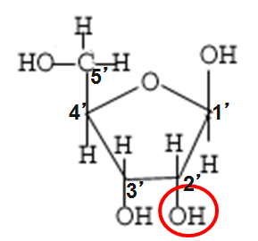
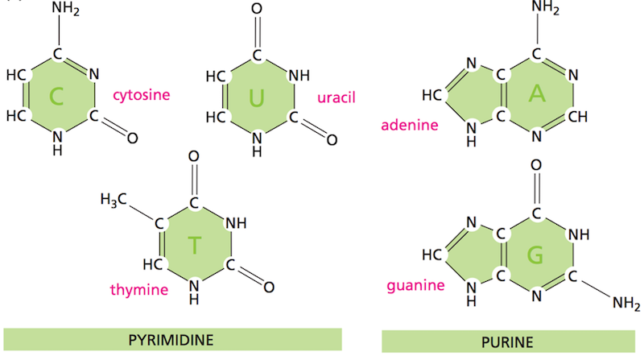
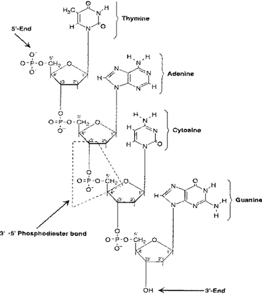
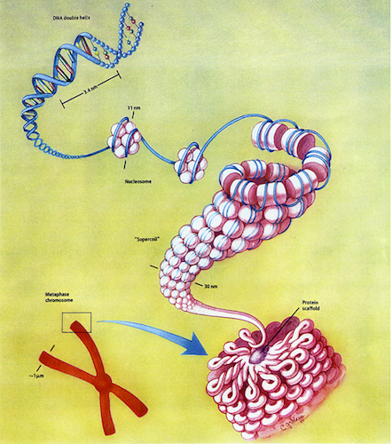
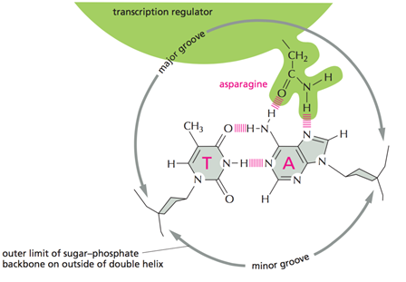

```{r setup, include=FALSE}
knitr::opts_chunk$set(echo = FALSE)
```

## Phylogenetic tree
<center>

</center>

## Overview
- Cells are the fundamental units of all living organisms.

- Each cell is a complex system consisting of many substructures.

- Two types of organisms: 
1. Unicellular organism (e.g., bacteria) - **Prokaryotic**
2. Multicellular organisms - **Eukaryotic**

## Procaryotic cell
<center>

</center>

## Eukaryotic cell
<center>

</center>

## Differences between Prokaryotic and Eukaryotic Cells {.smaller}
<center>

</center>

http://www.getmededu.com/differences-between-prokaryotic-and-eukaryotic-cells.html 

## The nucleus
- The nucleus is a sub-compartment found only in eukaryotic cells, in which the organism's DNA resides. 
- Enclosing the nucleus is the nuclear membrane, the protective wall that separates the nucleus from the rest of the cell, which is called the cytoplasm. 

- The entire cell is enclosed by the plasma membrane. 

- Embedded within this membrane is a variety of protein structures that act as channels and pumps to control movement into and out of the cell.

## Cells and the genome
- Each cell contains a complete copy of an organism's genome, or blueprint for all cellular structures and activities.

- The genome is distributed along chromosomes, which are made of compressed and entwined DNA. 

- Cells are of many different types (e.g. blood, skin, nerve cells), but all can be traced back to a single cell, the fertilized egg. 

## Chromosomes
- Chromosomes are packets of compressed and entwined DNA and are located in the nucleus

- Each chromosome carries its own unique set of genes. The specific site along a specific chromosome that a gene is located is called its genetic locus.

- Humans have a total of 46 chromosomes: 44 autosomes and 2 sex chromosomes. Autosomes occur in pairs. 

- Because there are two copies of each autosome, there are 2 alleles of a gene at each locus. 

- Germ cells, sperm and egg, carry only a single copy of each chromosome and gene and are called haploid. 

## Physical map of sex chromosomes
<center>

</center>

## Karyotype
- **Cytogenetics** is the study of normal and abnormal chromosomes. 

- The normal configuration of chromosomes is often termed the **euploid** karyotypic state. 

- Euploidy implies that each of the autosomes is present in normally structured pairs and that the X and Y chromosome are present in normally structure pairs for the sex of the individual. 

- Deviation from the euploid karyotype - the state termed **aneuploidy** - is some alteration in the overall chromosome structure, such as loss of entire chromosomes, the presence of extra copies of chromosomes, etc.

## Karyotype
<center>

</center>

## Cell cycle
<center>

</center>
https://www.youtube.com/watch?v=NR0mdDJMHIQ 

## Genes and genome
- **Genes** are discrete hereditary units located on the chromosomes (DNA).

- Each gene provides a clear and unambiguous set of instructions for producing some property of its organism. 

- The complete set of genes in an organism is referred to as its **genome**.

## Building blocks of DNA
- The basic unit (**nucleotide**) is composed of an organic **base** attached to a deoxyribose **sugar**

- The **phosphate** group also attached to the sugar

- The **base** is one of cytosine (C), thymine (T), adenine (A), and guanine (G)

## Nucleotide structure
<center>

</center>

## Nucleotide structure
<div class="columns-2">
<ul>
- Ribose Sugar

</ul>
<ul>
- Deoxyribose Sugar

</ul>
</div>

## Bases
<center>

</center>

## Discovery of double helix, 1953
- James Watson and Francis Crick
<center>

</center>

## Before the discovery
<center>

</center>

## Genomic DNA
- DNA is a **double helix**, with bases to the center (like rungs on a ladder) and sugar-phosphate units along the sides of the helix (like the sides of a twisted ladder).

- The strands are **complementary** (Watson-Crick base pairing rules) 

- A (purine) pairs with T (pyrimidines) C (pyrimidines) pairs with G (purine) 

- The pairs held together by hydrogen bonds. The helix is caused by the use of the hydrogen bonds between the single-strands 

## Nucleic acid strand
- Strand synthesis - from 5' to 3' end: (5') TACG (3')
<center>

</center>

## Double strand: DNA base pairing
- The two strands are held together by hydrogen bonds between nitrogen bases
<center>

</center>

## Rules of base pairing
- Rules of base pairing: A-T(U), C-G (and G-U in RNA)
<center>

</center>

## Base pairing
- The force that holds a base pair together is a weak hydrogen bond. 

- Although each individual bond is weak, their cumulative effect along the strands is strong enough to bind the two strands tightly together. 

- As a result, DNA is chemically inert and is a stable carrier of genetic information. 

## Helixes conformation {.smaller}
<center>

</center>

- A: B-form: Right-handed, 3.4 nm between bases, 10 bases per turn
- B: A-form: Right-handed, 2.3 nm between bases, 11 bases per turn
- C: Z-form: Left-handed

## Helixes conformation {.smaller}
<center>

</center>

- A: B-form: Right-handed, 3.4 nm between bases, 10 bases per turn
- B: A-form: Right-handed, 2.3 nm between bases, 11 bases per turn
- C: Z-form: Left-handed

## Eukaryotic DNA packaging
<center>

</center>
http://www.hhmi.org/biointeractive/dna-packaging 

## The central dogma of molecular biology {.columns-2}


- Formulated by Francis Crick in 1956

>- **DNA makes RNA and RNA makes protein**
>- **Transcription** is the making of an RNA molecule off a DNA template. 
>- **Translation** is the making of a protein off an RNA template.

## DNA replication
- In DNA replication, the DNA molecule unwinds and the "ladder" unzips, thereby disrupting the weak bonds between the base pairs and allowing the strands to separate. 

- Nucleotides have to be assembled and available in the nucleus, along with energy to make bonds between nucleotides. 

- DNA polymerases unzip the helix by breaking the H-bonds btw bases

- Once the polymerases have opened the molecule, an area known as the replication bubble forms (always initiated at a certain set of nucleotides, the origin of replication). 

- New nucleotides are placed in the fork and link to the corresponding parental nucleotide already there (A with T, C with G). 


## DNA replication
<center>

</center>
https://www.youtube.com/watch?v=TNKWgcFPHqw 

## RNA vs. DNA: Single vs. double strands
- **RNA - ribonucleic acid**: 
1. Single strand. 
2. Ribose sugar. 
3. AUCG nucleotides
- **DNA - deoxyribonucleic acid**: 
1. Double strand. 
2. Deoxyribose sugar.
3. ATCG nucleotides

## Nucleic acids - RNA
- **Messenger RNA (mRNA)** - carrier of genetic information
- **Transfer RNA (tRNA)** - deliver amino acids for protein synthesis
- **Ribosomal RNA (rRNA)** - central component of ribosome, protein manufacturing machinery
- **Small RNA (siRNA, miRNA, snRNA, piwiRNA)** - regulation of transcription/translation

## Transcription
- In transcription, the DNA double helix opens along its length

- One strand of the open helix remains inactive, while the other strand acts as a template against which a complementary strand of mRNA forms 

- The sequence of bases along the mRNA strand is identical to the sequence of bases along the inactive DNA strand, except uracil (U) replaces T. Also RNA has ribose sugar instead of deoxyribose sugar. 

- RNA (single-stranded) moves out into the cytoplasm. 

## RNA transcribed from 5' to 3' end
<center>

</center>

## Three RNA polymerases
- RNA polymerase is an enzyme that produces RNA
1. RNA Pol I - transcription of ribosomal RNA (not the 5S subunit)
2. RNA Pol II - mRNA, snRNA, microRNA
3. RNA Pol III - tRNA, 5S rRNA, small RNA

## Three stages of transcription {.smaller}
<center>

</center>

http://vcell.ndsu.nodak.edu/animations/transcription/movie-flash.htm 

## Gene structure in prokaryotes
<center>

</center>

## Gene structure in eukaryotes
- Non-coding interruptions are known as intervening sequences or **introns**. 

- Coding sequences that are expressed are **exons**. 

- Most, but not all structural eukaryote genes contain introns. Although transcribed, these introns are excised (cut out) before translation. 

## Gene structure in eukaryotes
<center>

</center>

- Exon - EXpressed regiON
- Intron - INTragenic regiON
- mRNA splicing - variants of mRNA assembly

## Alternative splicing
<center>

</center>
- Tissue specific alternative splicing patterns of the **$\alpha$-tropomyosin** pre-mRNA molecule. Introns are black carets; exons are blue rectangles. 

## RNA processing
- After eukaryotes transcribe an RNA, the RNA transcript is extensively modified before export to the cytoplasm. 

- A **cap of 7-methylguanine** (a series of an unusual base) is added to the 5' end of the mRNA. This cap is essential for binding the mRNA to the ribosome. 

- A **string of adenines** (as many as 200 nucleotides known as poly-A) is added to the 3' end of the mRNA after transcription. The function of a poly-A tail is not known, but it can be used to capture mRNAs for study. 

- Introns are cut out of the message and the exons are spliced together before the mRNA leaves the nucleus. 

## RNA processing {.columns-2}


- 5' cap - 7-methylguanylate (m7G), 5'-5' triphosphate linkage
- 3' tail - poly (A) tail, 100-250 bases of adenylic acid
- m7G, 1st and 2nd riboses are methylated

http://vcell.ndsu.nodak.edu/animations/mrnaprocessing/movie-flash.htm

## RNA strand structure
- Single stranded
- Hairpin structure
<center>

</center>

## RNA strand structure
- Transfer RNA (tRNA) structure
<center>

</center>

## Translation
- In translation, the mRNA serves as a template for protein synthesis. 

- The sequence of bases along the mRNA is thus converted into a string of amino acids. 

- Consecutive non-overlapping triplets of bases (called codons) act as the code to specify the particular amino acids

- There are 64 possible codons but only 20 amino acids. 

- There is room for redundancy - this provides a safeguard against small errors that might occur during transcription. 

http://vcell.ndsu.nodak.edu/animations/translation/movie-flash.htm

## Translation code
<center>

</center>

## Exercise: Transcribe and translate 
- http://learn.genetics.utah.edu/content/basics/transcribe/TranscribeTranslate.swf

- http://sepuplhs.org/high/sgi/teachers/genetics_act16_sim.html

## Gene expression
- Each cell contains a complete copy of the organism's genome. A gene that is transcribed is said to be expressed

- Not all cells express the same genes which is why different cells perform different functions

- Even within the same cell different genes will be expressed at different times and perhaps at different levels

## Gene expression
- A few exceptions are "housekeeping" genes, which are in constant use to maintain basic cell function. 
- Differential gene expression (when, where and in what quantity) is what makes cells different. 

## Transcription factors
- Transcription factors (TFs) are proteins that bind to specific DNA sequences in the control region of each gene and determine whether or not the gene will be transcribed. 

- The specific stretch of nucleotide sequence to which the TFs bind, often called a sequence motif, is usually quite short, typically 5-10 nucleotides long. 
<center>

</center>

## Transcription factors
- Some TFs provide the RNA polymerase enzyme with access to the gene while other TFs block such access to ensure the gene is transcriptionally repressed

- Histone modifications may also affect transcription by RNA polymerases of specific regions of chromosomal DNA. Methylation of CpG sites and microRNAs also affect gene expression. 

<center>

</center>

## Human Genome Project
- Computational biology attempts to use genome sequence to ascertain function of genes. 

- Although genomes vary slightly from person to person, it seemed reasonable to try to establish a consensus human genome sequence. 

- Robert Sinsheimer, chancellor of UC Santa Cruz, proposed to sequence the human genome in 1984. 

- After much debate, the human genome project started in October 1990. 

## Genome sizes compared
<center>

</center>

http://www.hhmi.org/biointeractive/coding-sequences-dna 

## The advent of genomics
- In the 1860's while studying peas, Gregor Mendel observed that genetic information is passed in particulate form from an organism to its offspring.

- He found that the heritable material controlling the smoothness of peas behaved independently of the material governing plant height or flower color. He deduced there are two copies of a gene for flower color and two copies of a gene for pea shape.

http://www.indiana.edu/~p1013447/dictionary/mendel.htm 

## Mendel's theory of inheritance
<center>

</center>

## The advent of genomics
- Mendel's work implied that the entire repertoire of an organism's genetic information - its genome - is organized as a collection of discrete, separable information packets, now called genes. 

- His research implied that the genetic constitution of an organism (its genotype) could be divided into hundreds, perhaps thousands of discrete information packets; in parallel, its observable outward appearance (its phenotype) could be subdivided into a large number of discrete physical or chemical traits. 

## Genetic definitions

- **genotype**: The genetic (alleleic) makeup of an organism with regard to an observed trait. The sum total of sequence variations (polymorphisms and mutations) present in a genome. 

- **phenotype**: The observed properties or outward appearance of a trait. 

## Homo/heterozygosity
- The two copies of a gene could convey different, possibly conflicting information. The different versions of a gene is called an allele. 

- Organisms with two identical alleles of a gene are **homozygous** while an organism with two different alleles of a gene are **heterozygous**.

## Homo/heterozygosity
- When a gene is **heterozygous**, the observed phenotype encoded by one allele of a gene is **dominant** with respect to the phenotype encoded by another allele, the **recessive** one. 

- The alleles of some genes may be **co-dominant**, wherein a blend of the two alleles result in a phenotype.

- **Incomplete penetrance** is when a dominant allele is present but the phenotype is not manifested because of the actions of other genes in the organism's genome. 

## Patterns of inheritance
- Autosomal dominant 
- Autosomal recessive
- X-linked dominant
- X-linked recessive
- Mitochondrial
- Non-Medelian (e.g., imprinting) 

## Genetic variations
- An allele that is present in the great majority of individuals within a species is termed **wild type** (naturally present in large numbers of apparently health organisms). 

- Though DNA is stable, the genome is corruptible, in other words, the genetic code can be changed. 

- **Mutations** are when one allele is converted into another allele or an allele is created. The collection of alleles present in the genomes of all members of a species is the **gene pool** for the species. 

## DNA alterations
- One base being replaced by another (**substitution**)
- A base being excised (**deletion**)
- A base being added (**insertion**)
- A small subsequence of bases being removed and reinserted in the opposite direction (**inversion**) 
- A small subsequence of bases being removed and reinserted in a different place (**translocation**) 

- Since DNA is information, and information typically has a beginning point, an inversion would produce an inactive or altered protein. 
- Likewise deletion or duplication will alter the gene product.

## Changes to chromosome's structure
<center>

</center>

## Neutral mutations are "silent" 
#### but may alter regulatory sites 
<center>

</center>

## Germline and somatic mutations
- Transmission of a mutation from one generation to the next, by the germ cells (sperm and egg), is said to occur via the **germ** line. 

- Mutations affecting the genomes of cells everywhere else in the body, which constitute the soma, have no prospect of being transmitted to offspring and are called **somatic** mutations. 

## Chromosomal abnormalities
1. Chromosome disorders 
- Congenital (7 per 1000 newborns, 50% of spontaneous first trimester abortions)
- Acquired (cancer) 

2. Single-gene disorders Individually rare 
- As a group affect $\sim$ 2% of population over lifespan 

3.  Multifactorial or complex disorders 
- A result of combination of genes
- May affect $\sim$ 60% of entire population 
