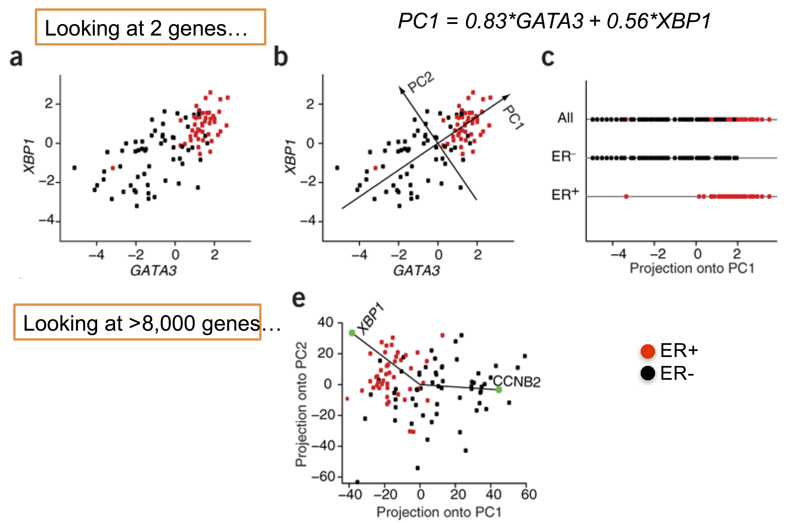
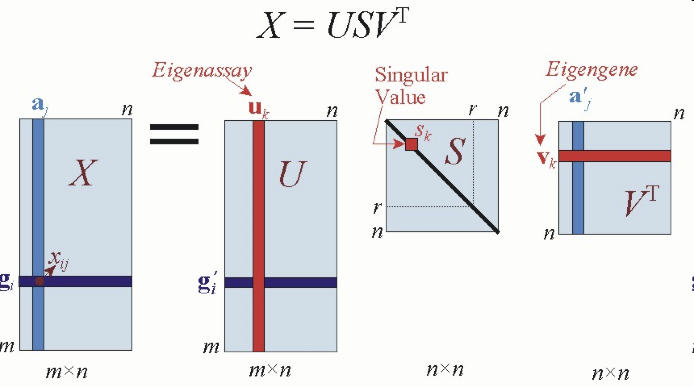

```{r setup, include=FALSE}
# Use 'verbatim = TRUE' as chunk option to show chunk code as is
require(knitr)
hook_source_def = knit_hooks$get('source')
knit_hooks$set(source = function(x, options){
  if (!is.null(options$verbatim) && options$verbatim){
    opts = gsub(",\\s*verbatim\\s*=\\s*TRUE\\s*", "", options$params.src)
    bef = sprintf('\n\n    ```{r %s}\n', opts, "\n")
    stringr::str_c(bef, paste(knitr:::indent_block(x, "    "), collapse = '\n'), "\n    ```\n")
  } else {
     hook_source_def(x, options)
  }
})
```

## What is clustering

- Partitioning of a data set into subsets.
- A cluster is a group of relatively homogeneous cases or observations

<center></center>

## What is clustering {.larger}

Given $n$ objects, assign them to $k$ groups (clusters) based on their similarity

- Unsupervised Machine Learning
- Class Discovery
- Difficult, and maybe ill-posed problem!

## Clustering impossible {.larger}

- **Scale-invariance** - meters vs inches
- **Richness** - all partitions as possible solutions
- **Consistency** - increasing distances between clusters and decreasing distances within clusters should yield the same solution

**No function exists that satisfies all three.**

J. Kleinberg. "**An Impossibility Theorem for Clustering. Advances in Neural Information Processing Systems**" (NIPS) 15, 2002. https://www.cs.cornell.edu/home/kleinber/nips15.pdf

## Clustering utopia

<center></center>

## Clustering reality

<center></center>

## Conducting Cluster Analysis

<center></center>

# Clustering gene expression

## Gene expression matrix

<center></center>

## Formulating the Problem  {.larger}

- Most important is **selecting the variables** on which the clustering is based.  
- Inclusion of even one or two irrelevant variables may distort a clustering solution.  
- Variables selected should describe the similarity between objects in terms that are relevant to the marketing research problem.  
- Should be selected based on past research, theory, or a consideration of the hypotheses being tested.  

## Filtering {.larger}

- Non-informative genes contribute random terms in the calculation of distances
- The resulting effect is that they hide the useful information provided by other genes
- Therefore, assign non-informative genes zero weight, i.e., exclude them from the cluster analysis

## Filtering examples {.larger} 

- **% Present >= X** - remove all genes that have missing values in greater than (100-X) percent of the columns
- **SD (Gene Vector) >= X** - remove all genes that have standard deviations of observed values less than X
- **At least X Observations with abs(Val) >= Y** - remove all genes that do not have at least X observations with absolute values greater than Y
- **MaxVal-MinVal >= X** - remove all genes whose maximum minus minimum values are less than X

## Clustering noise

<center></center>

## Cluster the right data {.larger}

Clustering works as expected when the data to be clustered is processed correctly

- **Log Transform Data** - replace all data values x by log2 (x). Why?
- **Center genes [mean or median]** - subtract the row-wise mean or median from the values in each row of data, so that the mean or median value of each row is 0.
- **Center arrays [mean or median]** - subtract the column-wise mean or median from the values in each column of data, so that the mean or median value of each column is 0.

## Cluster the right data

Clustering works as expected when the data to be clustered is processed correctly

- **Normalize genes** - multiply all values in each row of data by a scale factor S so that the sum of the squares of the values in each row is 1.0 (a separate S is computed for each row).
- **Normalize arrays** - multiply all values in each column of data by a scale factor S so that the sum of the squares of the values in each column is 1.0 (a separate S is computed for each column).

- These operations are not associative, so the order in which these operations is applied is very important
- Log transforming centered genes are not the same as centering log transformed genes.

## Standartization

In many cases, we are not interested in the absolute amplitudes of gene expression, but in the relative changes. Then, we standardize:

$$g_s=(g-\hat{g})/\sigma(g)$$

Standardized gene expression vectors have a mean value of zero and a standard deviation of one.

<center></center>

# How to define (dis)similarity among objects

## Distance {.larger} 

- Clustering organizes things that are close into groups 
- What does it mean for two genes to be close? 
- What does it mean for two samples to be close? 
- Once we know this, how do we define groups? 

## Distance {.larger}

- We need a mathematical definition of distance between two points 
- What are points? 
- If each gene is a point, what is the mathematical definition of a point? 

## Points

$Gene_1= (E_{11}, E{12}, ..., E{1N})$ 

$Gene_2= (E_{21}, E{22}, ..., E{2N})$ 

&nbsp;

$Sample_1= (E_{11}, E_{21}, ..., E_{G1})$

$Sample_2= (E_{12}, E_{22}, ..., E_{G2})$

&nbsp;

$E_{gi}=expression \; gene \; g, \; sample \; i$ 

## Distance definition {.larger}

For all objects $i$, $j$, and $h$

<center></center>

## Most famous distance

**Euclidean distance**

Example distance between gene 1 and 2: 

– Sqrt of Sum of $(E_{1i} - E_{2i})^2$, $i=1,...,N$

- When N is 2, this is distance as we know it: 

<center></center>

- When N is 20,000 you have to think abstractly 

## Distance measures {.larger}

<center></center>

>- Disadvantages: not scale invariant, not for negative correlations

## Distance measures {.larger}

- When deciding on an appropriate value of $q$, the investigator must decide whether emphasis should be placed on large differences. 
- Larger values of $q$ give relatively more emphasis to larger differences.

## Distance measures {.larger}

- Canberra distance

<center></center>

- Binary (0/1 vectors), aka Jaccard distance

<center></center>

- Maximum distance between two components of $x$ and $y$

## Similarity definition {.larger}

- For all objects $i$, $j$

<center></center>

## Similarity measures {.larger}

- Gene expression profiles represent comparative expression measures
- Euclidean distance may not be meaningful
- Need distance measure that score based on similarity
- The more objects $i$ and $j$ are alike (or close) the larger $s(i,j)$ becomes

## Similarity measures {.larger}

Cosine similarity. From Euclidean dot product between two non-zero vectors:

<center></center>

The cosine similarity is

<center></center>

## Similarity measures {.larger}

Pearson correlation coefficient [-1, 1]

Vectors are normalized to the vector’s means

<center></center>

Convert to dissimilarity [0, 1]

$d(i,j)=(1-s(i,j))/2$

## Distances between gene expression profiles

<center></center>

## Convert correlation to dissmilarity {.larger}

$$d(X_i,X_j)=\frac{1-Cor(X_i, X_j)}{2}$$

## The (dis-)similarity matrixes

<center></center>

## The (dis-)similarity matrixes

<center></center>

## Clustering binary data {.larger}

- Two columns with binary data, encoded $0$ and $1$
- $a$ - number of rows where both columns are 1
- $b$ - number of rows where this and not the other column is 1
- $c$ - number of rows where the other and not this column is 1
- $d$ - number of rows where both columns are 0

**Jaccard distance**

$$\frac{a}{a+b+c}$$

## Clustering binary data {.larger}

- Two columns with binary data, encoded $0$ and $1$
- $a$ - number of rows where both columns are 1
- $b$ - number of rows where this and not the other column is 1
- $c$ - number of rows where the other and not this column is 1
- $d$ - number of rows where both columns are 0

**Tanimoto distance**

$$\frac{a+d}{a+d+2(b+c)}$$

## Clustering categorical data

<center></center>

## Clustering mixed data {.larger}

**Gower distance**

J. C. Gower "**A General Coefficient of Similarity and Some of Its Properties**" Biometrics 1971 http://venus.unive.it/romanaz/modstat_ba/gowdis.pdf

- Idea: Use distance measure between 0 and 1 for each pair of variables: $d_{ij}^{(f)}$
- Aggregate: $d(i,j)=\frac{1}{p}\sum_{i=1}^p{d_{ij}^{(f)}}$

## Gower distance {.larger}

How to calculate distance measure for each pair of variables

- **Quantitative**: interval-scaled distance $d_{ij}^{(f)}=\frac{|x_{if} - x_{jf}|}{R_f}$, where $x_{if}$ is the value for object $i$ in variable $f$, and $R_f$ is the range of variable $f$ for all objects

- **Categorical**: use "1" when $x_{if}$ and $x_{jf}$ agree, and "0" otherwise

- **Ordinal**: Use normalized ranks, then like interval-scaled based on range

## Choose (dis-)similarity metric {.larger}

- Think hard about this step! 
- Remember: garbage in - garbage out 
- The metric that you pick should be a valid measure of the distance/similarity of genes. 

**Examples**

- Applying correlation to highly skewed data will provide misleading results. 
- Applying Euclidean distance to data measured on categorical scale will be invalid. 

## Distances in R {.larger}

| Function                       | Package          | Distances                                   |
|--------------------------------|------------------|---------------------------------------------|
| dist                           | stats            | Euclidean, Manhattan, Canberra, max, binary |
| daisy                          | cluster, bioDist | Euclidean, Manhattan                        |
| distancematrix, distancevector | hopach           | Euclidean, cor, cosine-angle (abs versions) |
| vegdist                        | vegan            | Jaccard, Gower, many others                 |

&nbsp;

Other packages: `cclust`, `e1071`, `flexmix`, `fpc`, `mclust`, `Mfuzz`, `class`

# Assembling objects into clusters

## Assembling objects into clusters {.larger}

- The number of ways to partition a set of $n$ objects into $k$ non-empty classes

<center></center>

- $S(n,1)=1$ - one way to partition $n$ object in to 1 group, or $n$ disjoint groups

- $S(n,2)=2^{n-1}-1$ ways to partition $n$ objects into two non-empty groups

## Classification of Clustering Procedures

<center></center>

## Hierarchical Clustering {.larger}

- Allows organization of the clustering data to be represented in a tree (dendrogram)
- **Agglomerative** (Bottom Up): each observation starts as own cluster. Clusters are merged based on similarities
- **Divisive** (Top Down):  all observations start in one cluster, and splits are performed recursively as one moves down the hierarchy. 

## Agglomerative clustering (bottom-up) {.larger}

- Idea: ensure nearby points end up in the same cluster
- Starts with as each gene in its own cluster
- Joins the two most similar clusters
- Then, joins next two most similar clusters
- Continues until all genes are in one cluster

## Divisive clustering (top-down) {.larger}

- Starts with all genes in one cluster
- Choose split so that genes in the two clusters are most similar (maximize “distance” between clusters)
- Find next split in same manner
- Continue until all genes are in single gene clusters

## Dendrograms

- We can then make dendrograms showing divisions 
- The y-axis represents the distance between the groups divided at that point 

<center></center>

## Dendrograms

- Note: Left and right is assigned arbitrarily. Vertical distance is what's matter
- Look at the height of division to find out distance. For example, S5 and S16 are very far.
 
<center></center>

## Which to use? {.larger}

- Both agglomerative and divisive are only ‘step-wise’ optimal: at each step the optimal split or merge is performed 

- Outliers will irreversibly change clustering structure

## Which to use? {.larger}

**Agglomerative/Bottom-Up**

– Computationally simpler, and more available. 

– More "precision" at bottom of tree 

– When looking for small clusters and/or many clusters, use 
agglomerative 

## Which to use? {.larger}

**Divisive/Top-Down** 

– More "precision" at top of tree. 

– When looking for large and/or few clusters, use divisive 

**Results ARE sensitive to choice!**

## Which to use?
 
<center></center>

# Linking objects based on the distance between them

## Linkage between clusters {.larger}

- **Single Linkage** - join clusters whose distance between closest genes is smallest (elliptical) 
- **Complete Linkage** - join clusters whose distance between furthest genes is smallest (spherical) 
- **Average Linkage** - join clusters whose average distance is the smallest. 

## Linkage between clusters

<center></center>

## Single linkage

<center></center>

## Complete linkage

<center></center>

## Average linkage

<center></center>

## Ward’s method

- **Ward's procedure** is commonly used. For each cluster, the sum of squares is calculated.  The two clusters with the smallest increase in the overall sum of squares within cluster distances are combined.  

<center></center>

- $\Delta$ - Merging cost of combining the clusters $A$ and $B$. $m_j$ is the center of cluster $j$, and $n_j$ is the number of points in it.
- The sum of squares starts at 0 (each point is in its own cluster), and grows as clusters are merged. Ward’s method keep this growth to minimum.

Ward, J. H., Jr. (1963), "**Hierarchical Grouping to Optimize an Objective Function**", Journal of the American Statistical Association http://iv.slis.indiana.edu/sw/data/ward.pdf

## Ward’s method

- The distance $d$ between two clusters $C_i$ and $C_j$ is defined as the loss of information (or: the increase in error) in merging two clusters.
- The error of a cluster $C$ is measured as the sum of distances between the objects in the cluster and the cluster centroid $cenC$.
- When merging two clusters, the error of the merged cluster is larger than the sum or errors of the two individual clusters, and therefore represents a loss of information. 
- The merging is performed on those clusters which are most homogeneous, to unify clusters such that the variation inside the merged clusters increases as little as possible.
- Ward’s method tends to create compact clusters of small size. It is a least squares method, so implicitly assumes a Gaussian model.

## Ward’s method {.larger}

An important issue though is the form of input that is necessary to give Ward’s method. For an input data matrix, $x$, in R’s `hclust` function the following command is required: `hclust(dist(x)^2, method="ward")` although this is not mentioned in the function’s documentation file.

Fionn Murtagh "**Ward’s Hierarchical Agglomerative Clustering Method: Which Algorithms Implement Ward’s Criterion?**" Journal of Classification 2014 https://link.springer.com/article/10.1007/s00357-014-9161-z

## K-means clustering {.larger}

- k-means clustering is a method of cluster analysis which aims to partition $n$ observations into $k$ clusters in which each observation belongs to the cluster with the nearest mean. 
- It is similar to the expectation-maximization algorithm for mixtures of Gaussians in that they both attempt to find the centers of natural clusters in the data.

## K-means statistics {.larger}

- The basic idea behind K-means clustering consists of defining clusters so that the total intra-cluster variation (known as total within-cluster variation) is minimized

$$minimize\left( \sum_{i=1}^kW(C_k) \right)$$

where $C_k$ is the $k^{th}$ cluster and $W(C_k)$ is the within-cluster variation of the cluster $C_k$.

## K-means - Algorithm 

<center></center>

J. B. MacQueen "**Some Methods for classification and Analysis of Multivariate Observations**" 1967 https://projecteuclid.org/euclid.bsmsp/1200512992

## K-means steps

- Simplified example  
– Expression for two genes for 14 samples  
- Some structure can be seen  

<center></center>

## K-means steps

- Choose $K$ centroids 
- These are starting values that the user picks. 
- There are some data driven ways to do it 

<center></center>

## K-means steps

– Find the closest centroid for each point  
- This is where distance is used  
- This is "first partition" into $K$ clusters  

<center></center>

## K-means steps

– Take the middle of each cluster  
- Re-compute centroids in relation to the middle  
- Use the new centroids to calculate distance  

<center></center>

## K-means steps

– Expression for two genes for 14 samples 

<center></center>

## PAM (K-medoids)

- **Centroid** - The average of the samples within a cluster 
- **Medoid** - The “representative object” within a cluster
- Initializing requires choosing medoids at random. 

<center></center>

## K-means limitations {.larger}

- Final results depend on starting values 
- How do we chose $K$? There are methods but not much theory saying what is best. 
- Where are the pretty pictures? 

## Self-organizing (Kohonen) maps {.larger}

- Self organizing map (SOM) is a learning method which produces low dimension data (e.g. $2D$) from high dimension data ($nD$) through the use of self-organizing neural networks
- E.g. an apple is different from a banana in more then two ways but they can be differentiated based on their size and color only. 

<center></center>

## Self-organizing (Kohonen) maps

If we present apples and bananas with points and similarity with lines then

- Two points connected by a shorter line are of same kind
- Two points connected by a longer line are of different kind
- Threshold $t$ is chosen to decide if the line is longer/shorter

<center></center>

## Self-organizing (Kohonen) maps

- We just created a map to differentiate an apple from banana based on two traits only.
- We have successfully “trained” the SOM, now anyone can use to “map” apples from banana and vice versa

<center></center>

## SOM in gene expression studies

<center></center>

## SOM example

<center></center>

## SOM example

<center></center>

## Application of SOM

**Genome Clustering**

- Goal: trying to understand the phylogenetic relationship between different genomes.
- Compute: bootstrap support of individual genomes for different phylogentic tree topologies, then cluster based on the topology support.

**Clustering Proteins based on the architecture of their activation loops**

- Align the proteins under investigation
- Extract the functional centers
- Turn 3D representation into 1D feature vectors
- Cluster based on the feature vectors

## Other approaches

- **Bi-clustering** - cluster both the genes and the experiments simultaneously to find appropriate context for clustering
- R packages: `iBBiG`, `FABIA`, `biclust`
- stand-alone: `BicAT` (Biclustering Analysis Toolbox))

<center></center>

# Dimensionality reduction techniques

## Principal Components Analysis {.larger}

- Principal component analysis (PCA) is a mathematical procedure that transforms a number of possibly correlated variables into a smaller number of uncorrelated variables called principal components
- Also know as Independent component analysis or _dimension reduction technique_
- PCA decomposes complex data relationship into simple components 
- New components are linear combinations of the original data

## Principal Components Analysis {.larger}

- Performs a rotation of the data that maximizes the variance in the new axes
- Projects high dimensional data into a low dimensional sub-space (visualized in 2-3 dims)
- Often captures much of the total data variation in a few dimensions (< 5)
- Exact solutions require a fully determined system (matrix with full rank), i.e. a “square” matrix with independent rows

## Principal Components Analysis {.larger}

- **PCA** - linear projection of the data onto major principal components defined by the eigenvectors of the covariance matrix.
- Criterion to be minimised: square of the distance between the original and projected data.

$$x_P=Px$$

$P$ is composed by eigenvectors of the covariance matrix

$$C=\frac{1}{n-1} \sum_i{(x_i - \mu)(x_i - \mu)^t }$$

## Principal Components Analysis

<center></center>

Example: Leukemia data sets by Golub et al.: Classification of ALL and AML

## Principal Components Analysis {.larger}

- Eigenvalue: describes the total variance in an eigenvector.  
- The eigenvector with the largest eigenvalue is the first principal component. The second largest eigenvalue will be the direction of the second largest variance.  

<center></center>

## Principal Components Analysis

<center></center>

## PCA for gene expression {.larger}

- Given a gene-by-sample matrix $X$ we decompose (centered and scaled) $X$ as $USV^T$ 
- We don’t usually care about total expression level and the dynamic range which may be dependent on technical factors 
- $U$, $V$ are orthonormal 
- $S$ diagonal-elements are eigenvalues = variance explained 

## PCA for gene expression {.larger}

- Columns of $V$ are 
    - Principle components
    - Eigengenes/metagenes that span the space of the gene transcriptional responses 

- Columns of $U$ are 
    - The “loadings”, or the correlation between the column and the component 
    - Eigenarrays/metaarrays - span the space of the gene transcriptional responses 

- Truncating $U$, $V$, $D$ to the first $k$ dimensions gives the best $k$-rank approximation of $X$ 

## Singular Value Decomposition

<center></center>

## PCA applied to cell cycle data 

<center></center>

## Other decomposition techniques

- Non-negative matrix factorization
- $A=WH$ ($A$, $W$, $H$ are non-negative)
- H defined a meta-gene space: similar to eigengenes
- Classification can be done in the meta-gene space

<center></center>

Jean-Philippe Brunet et al. PNAS 2004;101:4164-4169

## NMF {.larger}

- Many computational methods
    - Cost function $|A-WH|$
    - Squared error - aka Frobenius norm
    - Kullback–Leibler divergence

- Optimization procedure
    - Most use stochastic initialization, and the results don’t always converge to the same answer

## NMF {.larger}

- $A=WH$ : Toy Biological interpretation
- Assume $k=2$
- We have 2 transcription factors that activate gene signatures $W1$ and $W2$
- $H$ represents the activity of each factor in each sample
- TF effects are additive 

## NMF {.larger}

- NMF operates in the original non-negative measurement space
- Highly expressed genes matter more 
- Positivity constraint is advantageous: positive correlation among genes is more likely to be biologically meaningful 
- NMF may more accurately capture the data generating process 

## NMF vs. PCA

<center></center>

- Results of PCA vs NMF for reducing the leukemia data with 72 samples in visualization. Sample 66 is mislabeled. However in 2-D display, the reduced data by NMF can clearly show this mistake while that by PCA cannot demonstrate the wrong. ‘PC’ stands  for principal component and ‘BE’ means basis experiment.

Weixiang Liu, Kehong Yuan, Datian Ye “**Reducing microarray data via nonnegative matrix factorization for visualization and clustering analysis**” Journal of Biomedical Informatic 2008,

## Multidimensional scaling {.larger}

MDS attempts to

- Identify abstract variables which have generated the inter-object similarity measures
- Reduce the dimension of the data in a non-linear fashion 
- Reproduce non-linear higher-dimensional structures on a lower-dimensional display

## Kruskal’s stress

$$stress=\sqrt{\frac{\sum{(d_{ij} - \hat{d_{ij}})^2}}{\sum{d_{ij}^2}}}$$

- Goodness-of-fit - Measures degree of correspondence between distances among points on the MDS map and the matrix input. 
- Start with distances $d_{ij}$
- Fit decreasing numbers $\hat{d_{ij}}$
- Subtract, square, sum
- Take a square root  
- Divide by a scaling factor

## MDS Basic Algorithm {.larger}

- Obtain and order the $M$ pairs of similarities
- Try a configuration in $q$ dimensions
    - Determine inter-item distances and reference numbers
    - Minimize Kruskal’s stress

- Move the points around to obtain an improved configuration
- Repeat until minimum stress is obtained

## Comparison Between PCA, MDS, and SOM {.larger}

- **PCA** tries to preserve the covariance of the original data
- **MDS** tries to preserve the metric (ordering relations) of the original space
- **SOM** tries to preserve the topology (local neighborhood relations), items projected to nearby locations are similar

# How good is your clustering?

## Assess cluster fit and stability {.larger}

- Most often ignored. 
- Cluster structure is treated as reliable and precise 
- BUT! Clustering is generally VERY sensitive to noise and to outliers 
- Measure cluster quality based on how “tight” the clusters are.
- Do genes in a cluster appear more similar to each other than genes in other clusters?

## Clustering evaluation methods {.larger}

- Sum of squares
- Homogeneity and Separation 
- Cluster Silhouettes and Silhouette coefficient: how similar genes within a cluster are to genes in other clusters
- Rand index
- Gap statistics
- Cross-validation

## Sum of squares {.larger}

- A good clustering yields clusters where genes have small within-cluster sum-of-squares (and high between-cluster sum-of-squares).

## Homogeneity {.larger}

- **Homogeneity** is calculated as the average distance between each gene expression profile and the center of
the cluster it belongs to

$$H_{k}=\frac{1}{N_g} \sum_{i \in k} d(X_i,C(X_i))$$

$N_g$ - total number of genes in the cluster

## Separation {.larger} 

– **Separation** is calculated as the weighted average distance between cluster centers

$$S_{ave}=\frac{1}{\sum_{k \neq l}{N_kN_l}} \sum_{k \neq l}{N_kN_ld(C_k,C_l)}$$

## Homogeneity and separation {.larger}

– Homogeneity reflects the compactness of the clusters while S reflects the overall distance between clusters  
– Decreasing Homogeneity or increasing Separation suggest an improvement in the clustering results  

## Variance Ratio Criterion (VCR) {.larger}

$$VRC_k=(SS_B/(K-1))/(SS_W/(N-K))$$

- $SS_B$ – between-cluster variation
- $SS_W$ – within-cluster variation

The goal is to maximize $VRC_k$ over the clusters

$$\kappa_k=(VRC_{k+1} - VRC_k) - (VRC_k - VRC_{k-1})$$

- Select K to minimize the value of kappaK
- Calinski & Harabasz (1974) 

## Silhouette

- Good clusters are those where the genes are close to each other compared to their next closest cluster.

$$s(i)=\frac{b(i)-a(i)}{max(a(i),b(i))}$$

- $b(i) = min(AVGD_{BETWEEN}(i,k))$
- $a(i) = AVGD_{WITHIN}(i)$
- How well observation $i$ matches the cluster assignment. Ranges $-1 < s(i) < 1$
- Overall silhouette: $SC=\frac{1}{N_g}\sum_{i=1}^{N_g}{s(i)}$
- Rousseeuw, Peter J. “**Silhouettes: A Graphical Aid to the Interpretation and Validation of Cluster Analysis.**” Journal of Computational and Applied Mathematics 1987 http://www.sciencedirect.com/science/article/pii/0377042787901257


## Silhouette plot

- The silhouette plot displays a measure of how close each point in one cluster is to points in the neighboring clusters. 
- Silhouette width near +1 indicates points that are very distant from neighboring clusters
- Silhouette width near 0 indicate points that are not distinctly in one cluster or another
- Negative width indicates points are probably assigned to the wrong cluster.

<center></center>

## Rand index

Cluster multiple times

- Clustering A: 1, 2, 2, 1, 1
- Clustering B: 2, 1, 2, 1, 1

Compare pairs

- $a: \; = \; and \; =$, the number of pairs assigned to the same cluster in A and in B
- $b: \; \neq \; and \; \neq$, ... different clusters in A and in B
- $c: \; \neq \; and \; =$, ... same in A, different in B
- $d: \; = \; and \; \neq$, ... same in B, different in A

## Rand index {.larger}

$$R=\frac{a+b}{a+b+c+d}$$

- Adjust the Rand index to make it vary between -1 and 1 (negative if less than expected)

- $AdjRand = (Rand – expect(Rand)) / (max(Rand) – expect(Rand))$ 

## Gap statistics {.larger}

- Cluster the observed data, varying the total number of clusters $k=1, 2, ... K$
- For each cluster, calculate the sum of the pairwise distances for all points

$$D_r=\sum_{i,i' \in C_r}{d_{ii'}}$$

- Calculate within-cluster dispersion measures

$$W_k=\sum_{r=1}^k{\frac{1}{2n_r}D_r}$$

## Gap statistics

<center></center>

## Cross-validation approaches {.larger}

- Cluster while leave-out $k$ experiments (or genes) 
- Measure how well cluster groups are preserved in left out experiment(s) 
- Or, measure agreement between test and training set

## Clustering validity {.larger}

- Hypothesis: if the clustering is valid, the linking of objects in the cluster tree should have a strong correlation with the distances between objects in the distance vector

<center></center>

## WADP - robustness of clustering {.larger}

- If the input data deviate slightly from their current value, will we get the same clustering?  
– Important in Microarray expression data analysis because of constant noise 

Bittner M. et.al. "**Molecular classification of cutaneous malignant melanoma by gene expression profiling**" Nature 2000  http://www.nature.com/nature/journal/v406/n6795/full/406536A0.html

## WADP - robustness of clustering {.larger}

- Perturb each original gene expression profile by $N(0, 0.01)$
- Re-normalize the data, cluster
- Cluster-specific discrepancy rate: $D/M$. That is, for the $M$ pairs of genes in an original cluster, count the number of gene pairs, $D$, that do not remain together in the clustering of the perturbed data, and take their ratio.
- The overall discrepancy ratio is the weighted average of the cluster-specific discrepancy rates.

## WADP - robustness of clustering {.larger}

- If there were originally $m_j$ genes in the cluster $j$, then there are $M_j=m_j(m_j-1)/2$ pairs of genes
- In the new clustering, identify how many of these paris ($D_j$) still remain in the cluster
- Calculate $D_j/M_j$

$$WADP=\frac{\sum_{j=1}^k{m_jD_j/M_j}}{\sum_{j=1}^k{m_j}}$$

# Summary

## Clustering pitfalls {.larger}

- Any data – even noise – can be clustered
- It is quite possible for there to be several different classifications of the same set of objects.
- It should be clear that any clustering produced should be related to the features in which the investigator in interested.

