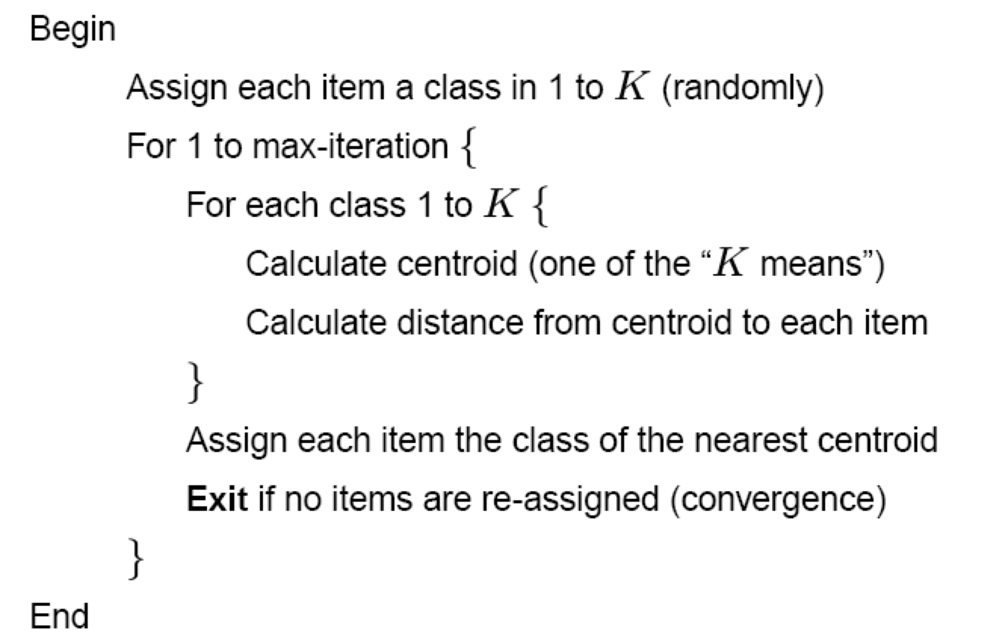
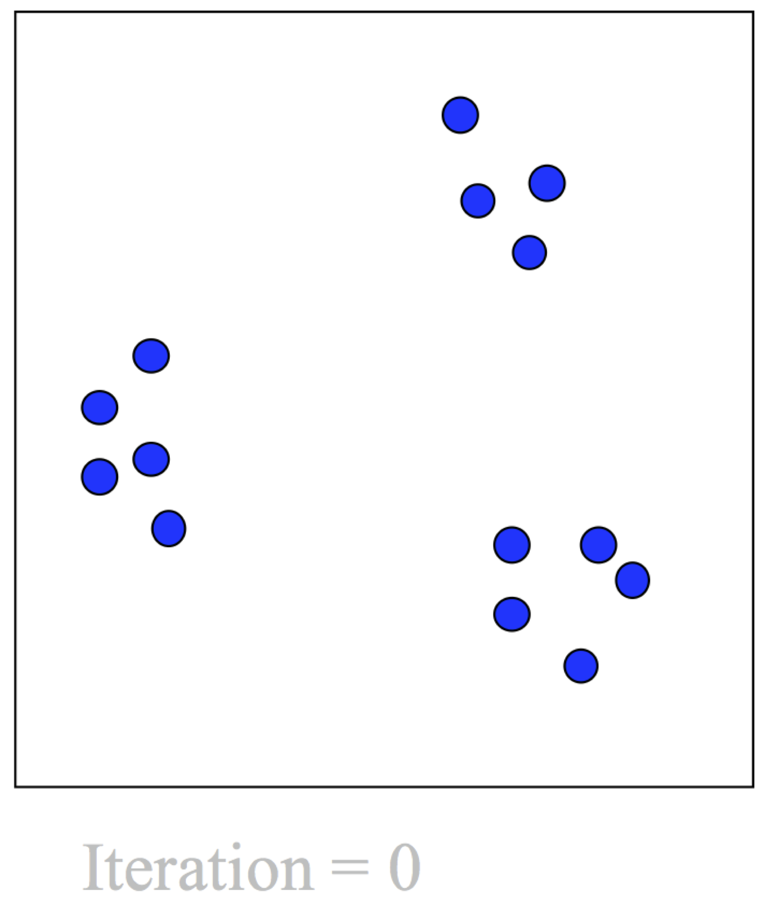
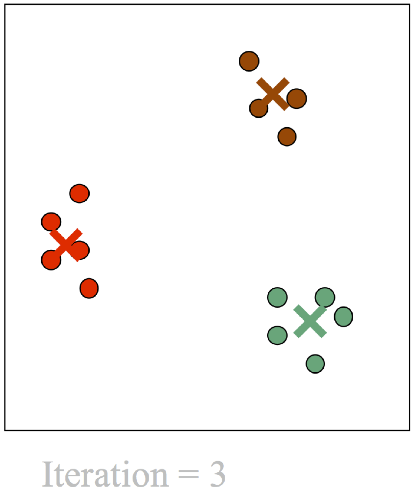
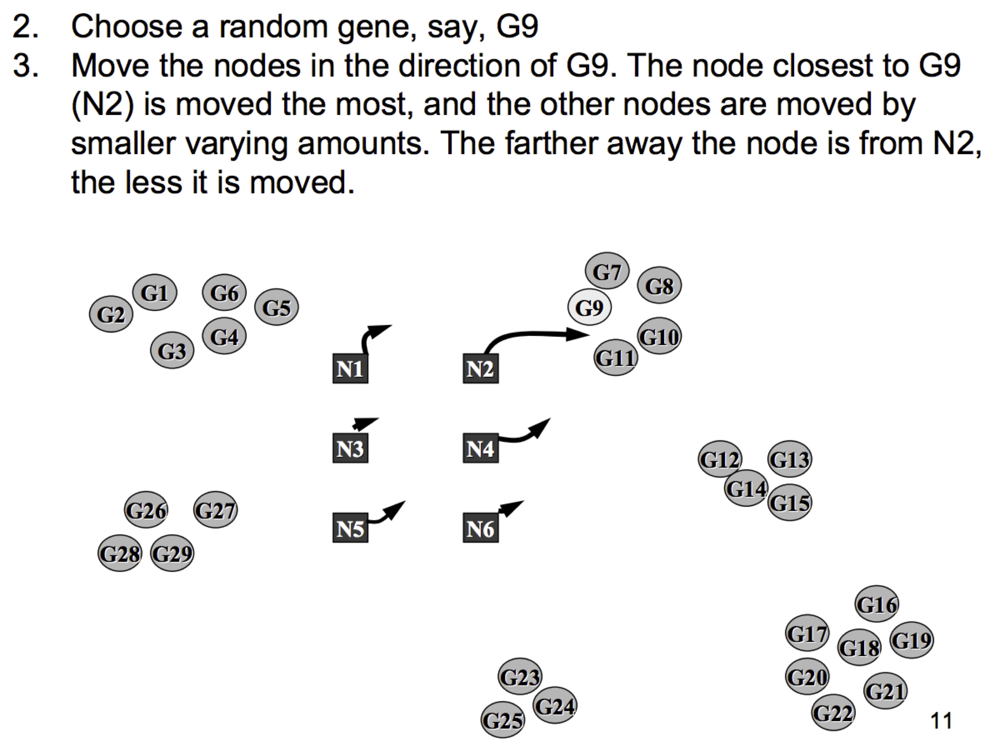
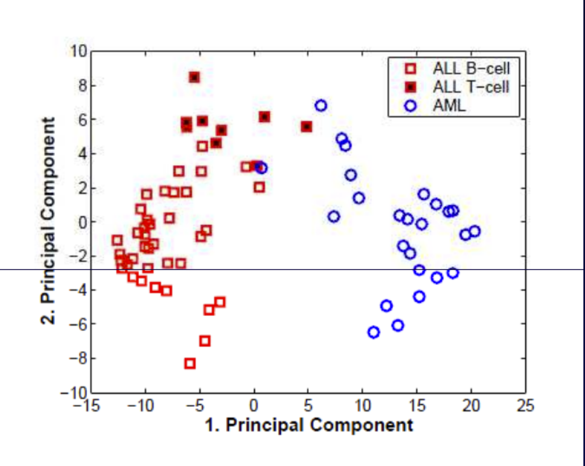

```{r setup, include=FALSE}
# Use 'verbatim = TRUE' as chunk option to show chunk code as is
require(knitr)
hook_source_def = knit_hooks$get('source')
knit_hooks$set(source = function(x, options){
  if (!is.null(options$verbatim) && options$verbatim){
    opts = gsub(",\\s*verbatim\\s*=\\s*TRUE\\s*", "", options$params.src)
    bef = sprintf('\n\n    ```{r %s}\n', opts, "\n")
    stringr::str_c(bef, paste(knitr:::indent_block(x, "    "), collapse = '\n'), "\n    ```\n")
  } else {
     hook_source_def(x, options)
  }
})
```

## K-means clustering {.larger}

- k-means clustering is a method of cluster analysis which aims to partition $n$ observations into $k$ clusters in which each observation belongs to the cluster with the nearest mean. 
- It is similar to the expectation-maximization algorithm for mixtures of Gaussians in that they both attempt to find the centers of natural clusters in the data.

## K-means statistics {.larger}

- The basic idea behind K-means clustering consists of defining clusters so that the total intra-cluster variation (known as total within-cluster variation) is minimized

$$minimize\left( \sum_{i=1}^kW(C_k) \right)$$

where $C_k$ is the $k^{th}$ cluster and $W(C_k)$ is the within-cluster variation of the cluster $C_k$.

## K-means - Algorithm 

<center></center>

J. B. MacQueen "**Some Methods for classification and Analysis of Multivariate Observations**" 1967 https://projecteuclid.org/euclid.bsmsp/1200512992

## K-means steps

- Simplified example  
– Expression for two genes for 14 samples  
- Some structure can be seen  

<center></center>

## K-means steps

- Choose $K$ centroids 
- These are starting values that the user picks. 
- There are some data driven ways to do it 

<center></center>

## K-means steps

– Find the closest centroid for each point  
- This is where distance is used  
- This is "first partition" into $K$ clusters  

<center></center>

## K-means steps

– Take the middle of each cluster  
- Re-compute centroids in relation to the middle  
- Use the new centroids to calculate distance  

<center></center>

## K-means steps

– Expression for two genes for 14 samples 

<center></center>

## PAM (K-medoids)

- **Centroid** - The average of the samples within a cluster 
- **Medoid** - The “representative object” within a cluster
- Initializing requires choosing medoids at random. 

<center></center>

## K-means limitations {.larger}

- Final results depend on starting values 
- How do we chose $K$? There are methods but not much theory saying what is best. 
- Where are the pretty pictures? 

## Self-organizing (Kohonen) maps {.larger}

- Self organizing map (SOM) is a learning method which produces low dimension data (e.g. $2D$) from high dimension data ($nD$) through the use of self-organizing neural networks
- E.g. an apple is different from a banana in more then two ways but they can be differentiated based on their size and color only. 

<center></center>

## Self-organizing (Kohonen) maps

If we present apples and bananas with points and similarity with lines then

- Two points connected by a shorter line are of same kind
- Two points connected by a longer line are of different kind
- Threshold $t$ is chosen to decide if the line is longer/shorter

<center></center>

## Self-organizing (Kohonen) maps

- We just created a map to differentiate an apple from banana based on two traits only.
- We have successfully “trained” the SOM, now anyone can use to “map” apples from banana and vice versa

<center></center>

## SOM in gene expression studies

<center></center>

## SOM example

<center></center>

## SOM example

<center></center>

## Application of SOM

**Genome Clustering**

- Goal: trying to understand the phylogenetic relationship between different genomes.
- Compute: bootstrap support of individual genomes for different phylogentic tree topologies, then cluster based on the topology support.

**Clustering Proteins based on the architecture of their activation loops**

- Align the proteins under investigation
- Extract the functional centers
- Turn 3D representation into 1D feature vectors
- Cluster based on the feature vectors

## Other approaches

- **Bi-clustering** - cluster both the genes and the experiments simultaneously to find appropriate context for clustering
- R packages: `iBBiG`, `FABIA`, `biclust`
- stand-alone: `BicAT` (Biclustering Analysis Toolbox))

<center></center>

# Dimensionality reduction techniques

## Principal Components Analysis {.larger}

- Principal component analysis (PCA) is a mathematical procedure that transforms a number of possibly correlated variables into a smaller number of uncorrelated variables called principal components
- Also know as Independent component analysis or _dimension reduction technique_
- PCA decomposes complex data relationship into simple components 
- New components are linear combinations of the original data

## Principal Components Analysis {.larger}

- Performs a rotation of the data that maximizes the variance in the new axes
- Projects high dimensional data into a low dimensional sub-space (visualized in 2-3 dims)
- Often captures much of the total data variation in a few dimensions (< 5)
- Exact solutions require a fully determined system (matrix with full rank), i.e. a “square” matrix with independent rows

## Principal Components Analysis {.larger}

- **PCA** - linear projection of the data onto major principal components defined by the eigenvectors of the covariance matrix.
- Criterion to be minimised: square of the distance between the original and projected data.

$$x_P=Px$$

$P$ is composed by eigenvectors of the covariance matrix

$$C=\frac{1}{n-1} \sum_i{(x_i - \mu)(x_i - \mu)^t }$$

## Principal Components Analysis

<center></center>

Example: Leukemia data sets by Golub et al.: Classification of ALL and AML

## Principal Components Analysis {.larger}

- Eigenvalue: describes the total variance in an eigenvector.  
- The eigenvector with the largest eigenvalue is the first principal component. The second largest eigenvalue will be the direction of the second largest variance.  

<center></center>

## Principal Components Analysis

<center></center>

## PCA for gene expression {.larger}

- Given a gene-by-sample matrix $X$ we decompose (centered and scaled) $X$ as $USV^T$ 
- We don’t usually care about total expression level and the dynamic range which may be dependent on technical factors 
- $U$, $V$ are orthonormal 
- $S$ diagonal-elements are eigenvalues = variance explained 

## PCA for gene expression {.larger}

- Columns of $V$ are 
    - Principle components
    - Eigengenes/metagenes that span the space of the gene transcriptional responses 

- Columns of $U$ are 
    - The “loadings”, or the correlation between the column and the component 
    - Eigenarrays/metaarrays - span the space of the gene transcriptional responses 

- Truncating $U$, $V$, $D$ to the first $k$ dimensions gives the best $k$-rank approximation of $X$ 

## Singular Value Decomposition

<center></center>

## PCA applied to cell cycle data 

<center></center>

## Other decomposition techniques

- Non-negative matrix factorization
- $A=WH$ ($A$, $W$, $H$ are non-negative)
- H defined a meta-gene space: similar to eigengenes
- Classification can be done in the meta-gene space

<center></center>

Jean-Philippe Brunet et al. PNAS 2004;101:4164-4169

## NMF {.larger}

- Many computational methods
    - Cost function $|A-WH|$
    - Squared error - aka Frobenius norm
    - Kullback–Leibler divergence

- Optimization procedure
    - Most use stochastic initialization, and the results don’t always converge to the same answer

## NMF {.larger}

- $A=WH$ : Toy Biological interpretation
- Assume $k=2$
- We have 2 transcription factors that activate gene signatures $W1$ and $W2$
- $H$ represents the activity of each factor in each sample
- TF effects are additive 

## NMF {.larger}

- NMF operates in the original non-negative measurement space
- Highly expressed genes matter more 
- Positivity constraint is advantageous: positive correlation among genes is more likely to be biologically meaningful 
- NMF may more accurately capture the data generating process 

## NMF vs. PCA

<center></center>

- Results of PCA vs NMF for reducing the leukemia data with 72 samples in visualization. Sample 66 is mislabeled. However in 2-D display, the reduced data by NMF can clearly show this mistake while that by PCA cannot demonstrate the wrong. ‘PC’ stands  for principal component and ‘BE’ means basis experiment.

Weixiang Liu, Kehong Yuan, Datian Ye “**Reducing microarray data via nonnegative matrix factorization for visualization and clustering analysis**” Journal of Biomedical Informatic 2008,

## Multidimensional scaling {.larger}

MDS attempts to

- Identify abstract variables which have generated the inter-object similarity measures
- Reduce the dimension of the data in a non-linear fashion 
- Reproduce non-linear higher-dimensional structures on a lower-dimensional display

## Kruskal’s stress

$$stress=\sqrt{\frac{\sum{(d_{ij} - \hat{d_{ij}})^2}}{\sum{d_{ij}^2}}}$$

- Goodness-of-fit - Measures degree of correspondence between distances among points on the MDS map and the matrix input. 
- Start with distances $d_{ij}$
- Fit decreasing numbers $\hat{d_{ij}}$
- Subtract, square, sum
- Take a square root  
- Divide by a scaling factor

## MDS Basic Algorithm {.larger}

- Obtain and order the $M$ pairs of similarities
- Try a configuration in $q$ dimensions
    - Determine inter-item distances and reference numbers
    - Minimize Kruskal’s stress

- Move the points around to obtain an improved configuration
- Repeat until minimum stress is obtained

## Comparison Between PCA, MDS, and SOM {.larger}

- **PCA** tries to preserve the covariance of the original data
- **MDS** tries to preserve the metric (ordering relations) of the original space
- **SOM** tries to preserve the topology (local neighborhood relations), items projected to nearby locations are similar

