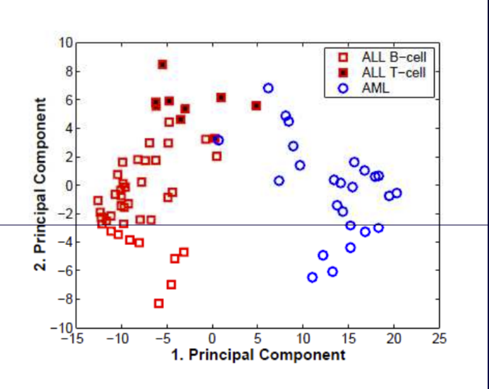
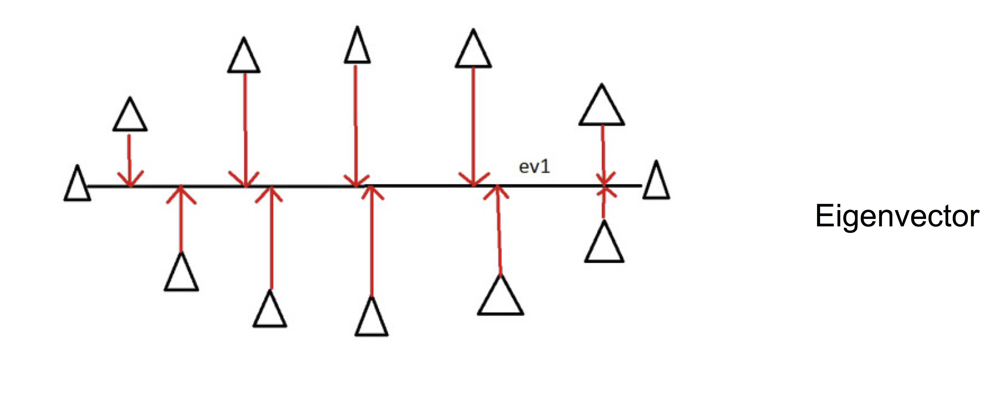
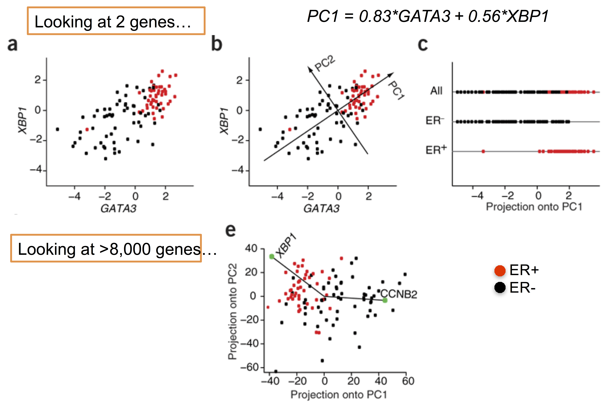
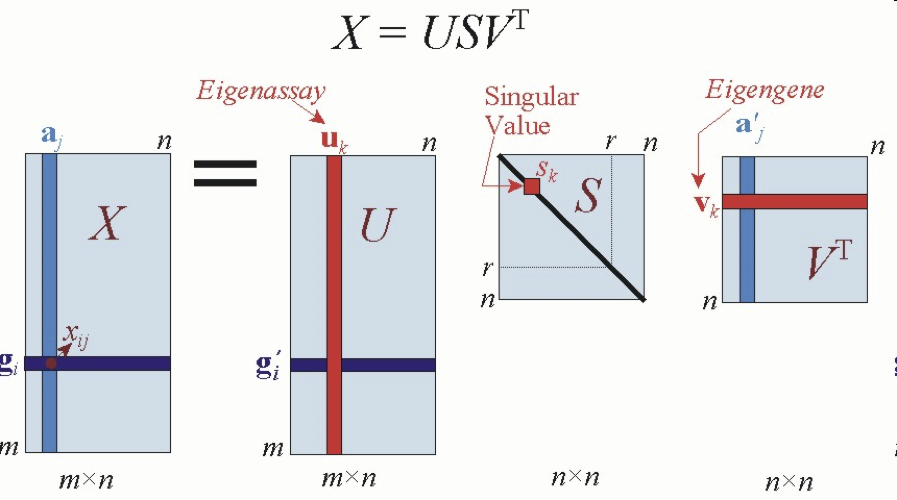

```{r setup, include=FALSE}
# Use 'verbatim = TRUE' as chunk option to show chunk code as is
require(knitr)
hook_source_def = knit_hooks$get('source')
knit_hooks$set(source = function(x, options){
  if (!is.null(options$verbatim) && options$verbatim){
    opts = gsub(",\\s*verbatim\\s*=\\s*TRUE\\s*", "", options$params.src)
    bef = sprintf('\n\n    ```{r %s}\n', opts, "\n")
    stringr::str_c(bef, paste(knitr:::indent_block(x, "    "), collapse = '\n'), "\n    ```\n")
  } else {
     hook_source_def(x, options)
  }
})
```

## Principal Components Analysis {.larger}

- Principal component analysis (PCA) is a mathematical procedure that transforms a number of possibly correlated variables into a smaller number of uncorrelated variables called principal components
- Also know as Independent component analysis or _dimension reduction technique_
- PCA decomposes complex data relationship into simple components 
- New components are linear combinations of the original data

## Principal Components Analysis {.larger}

- Performs a rotation of the data that maximizes the variance in the new axes
- Projects high dimensional data into a low dimensional sub-space (visualized in 2-3 dims)
- Often captures much of the total data variation in a few dimensions (< 5)
- Exact solutions require a fully determined system (matrix with full rank), i.e. a “square” matrix with independent rows

## Principal Components Analysis {.larger}

- **PCA** - linear projection of the data onto major principal components defined by the eigenvectors of the covariance matrix.
- Criterion to be minimised: square of the distance between the original and projected data.

$$x_P=Px$$

$P$ is composed by eigenvectors of the covariance matrix

$$C=\frac{1}{n-1} \sum_i{(x_i - \mu)(x_i - \mu)^t }$$

## Principal Components Analysis

<center></center>

Example: Leukemia data sets by Golub et al.: Classification of ALL and AML

## Principal Components Analysis {.larger}

- Eigenvalue: describes the total variance in an eigenvector.  
- The eigenvector with the largest eigenvalue is the first principal component. The second largest eigenvalue will be the direction of the second largest variance.  

<center></center>

## Principal Components Analysis

<center></center>

## PCA for gene expression {.larger}

- Given a gene-by-sample matrix $X$ we decompose (centered and scaled) $X$ as $USV^T$ 
- We don’t usually care about total expression level and the dynamic range which may be dependent on technical factors 
- $U$, $V$ are orthonormal 
- $S$ diagonal-elements are eigenvalues = variance explained 

## PCA for gene expression {.larger}

- Columns of $V$ are 
    - Principle components
    - Eigengenes/metagenes that span the space of the gene transcriptional responses 

- Columns of $U$ are 
    - The “loadings”, or the correlation between the column and the component 
    - Eigenarrays/metaarrays - span the space of the gene transcriptional responses 

- Truncating $U$, $V$, $D$ to the first $k$ dimensions gives the best $k$-rank approximation of $X$ 

## Singular Value Decomposition

<center></center>

## PCA applied to cell cycle data 

<center></center>
