```{r setup, include=FALSE}
require(knitr)
hook_source_def = knit_hooks$get('source')
knit_hooks$set(source = function(x, options){
  if (!is.null(options$verbatim) && options$verbatim){
    opts = gsub(",\\s*verbatim\\s*=\\s*TRUE\\s*", "", options$params.src)
    bef = sprintf('\n\n    ```{r %s}\n', opts, "\n")
    stringr::str_c(bef, paste(knitr:::indent_block(x, "    "), collapse = '\n'), "\n    ```\n")
  } else {
     hook_source_def(x, options)
  }
})
```

## Principles of experimental design {.larger}

- **Replication**. It allows the experimenter to obtain an estimate of the experimental error

>- **Randomization**. It requires the experimenter to use a random choice of every factor that is not of interest but might influence the outcome of the experiment. Such factors are called nuisance factors

>- **Blocking**. Creating homogeneous blocks of data in which a nuisance factor is kept constant while the factor of interest is allowed to vary. Used to increase the accuracy with which the influence of the various factors is assessed in a given experiment

>- **Block what you can, randomize what you cannot**

## Replicates {.larger}

<center>
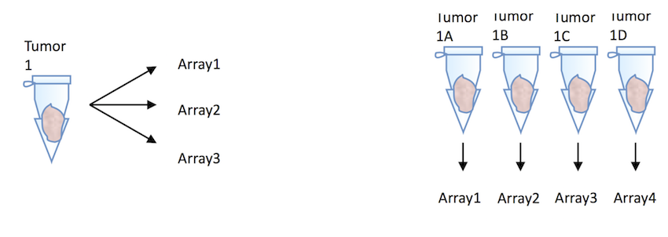
</center>

- **Technical** replicates and **Biological** replicates 

>- Rule of thumb: for two-fold change – use 3 replicates

>- Smaller change – 5 replicates

## Randomization {.larger}

- Each gene has multiple probes – randomize their position on the slide

<center>
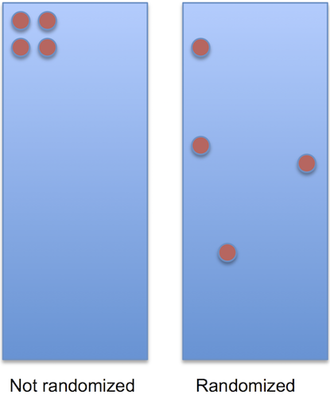
</center>

## Blocking {.larger}

- Treatment and RNA extraction days are confounded

<center>
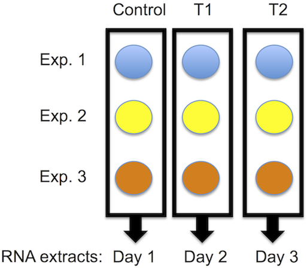
</center>

## Blocking {.larger}

- Block replicated experiments

<center>
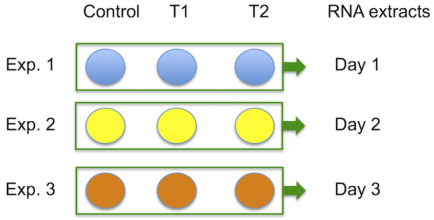
</center>

## Pooling

<center>
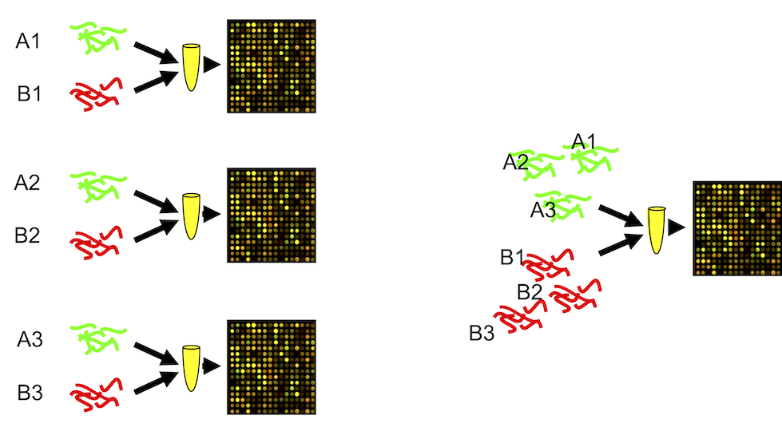
</center>

## Pooling 

- OK when the interest is not on the individual, but on common patterns across individuals (population characteristics)
- Results in averaging -> reduces variability -> substantive features are easier to find
- Recommended when fewer than 3 arrays are used in each condition
- Beneficial when many subjects are pooled
one pool vs independent samples in multiple pools 

&nbsp;

**"inference for most genes was not affected by pooling"**

C. Kendziorski, R. A. Irizarry, K.-S. Chen, J. D. Haag, and M. N. Gould. "On the utility of pooling biological samples in microarray experiments". PNAS March 2005, 102(12) 4252-4257

## How to allocate the samples to microarrays?

- which samples should be hybridized on the same slide?
- how different experimental designs affect outcome?
- what is the optimal design?

<center>
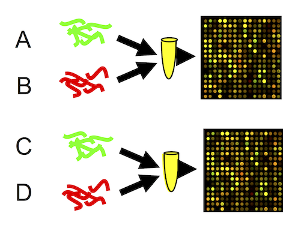
</center>

## Example of four-array experiment | Dye swap

<center>
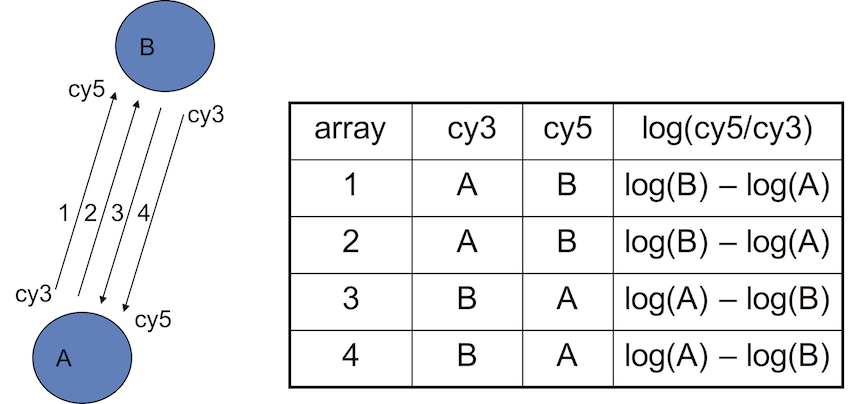
</center>

## Common reference design

<center>
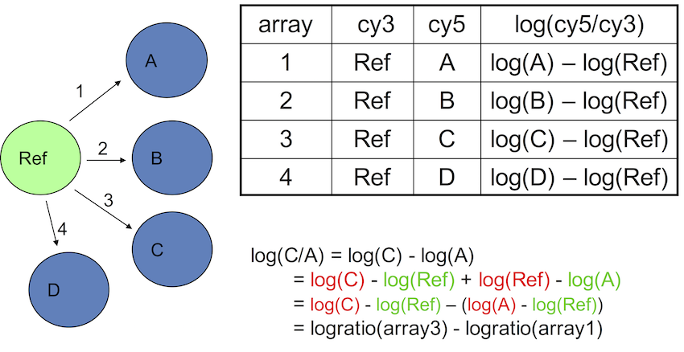
</center>

## Loop design

<center>
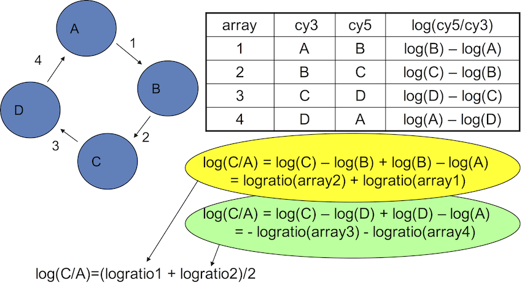
</center>

## Comparing the designs

<center>
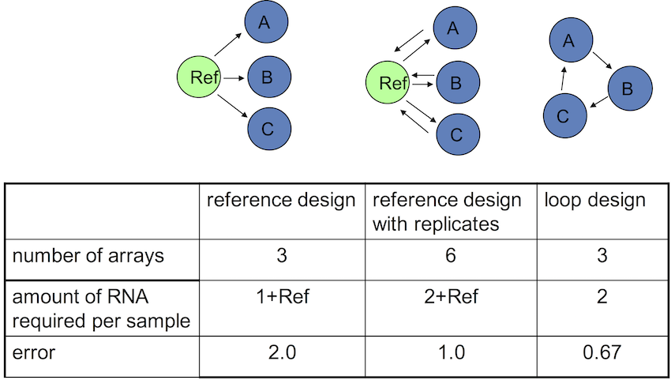
</center>

## Design with all direct pairwise comparisons

<center>
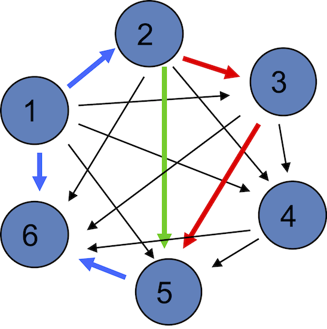
</center>

