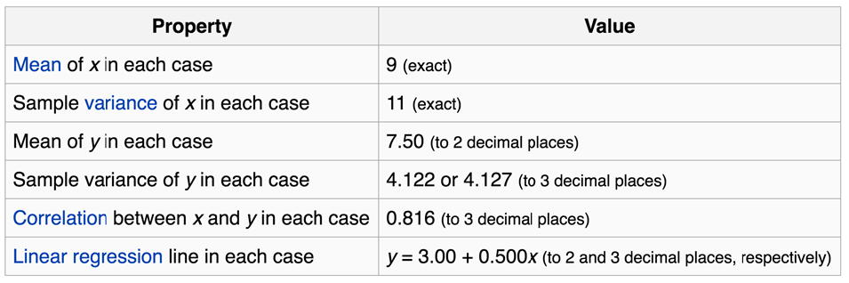
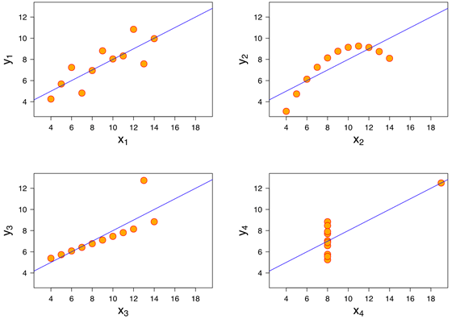
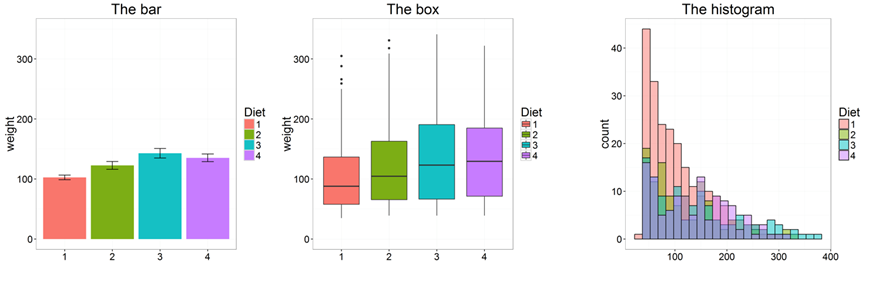
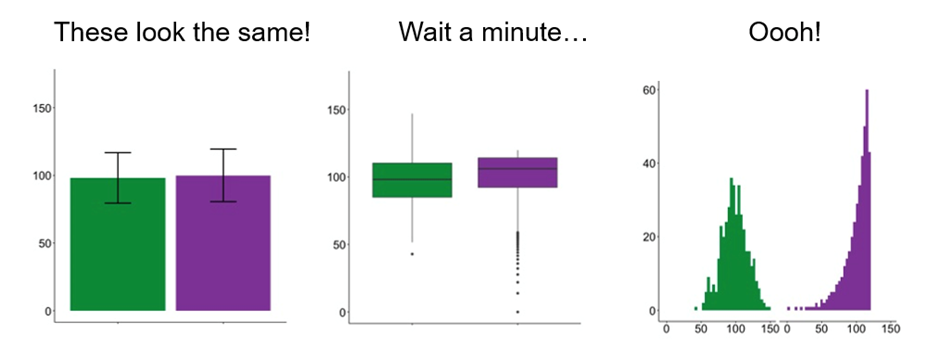
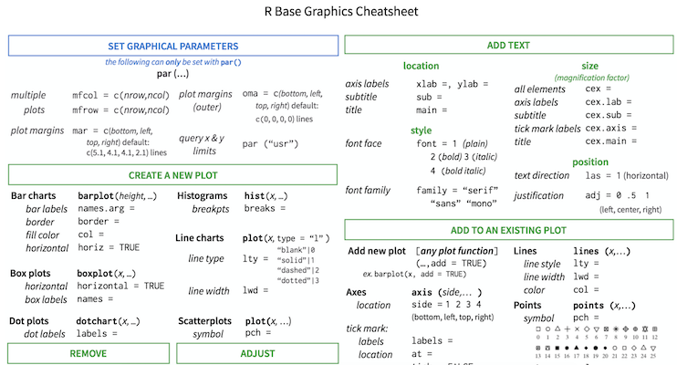
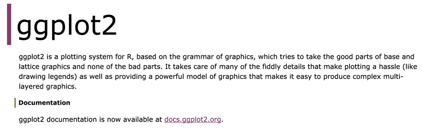

```{r setup, include=FALSE}
require(knitr)
hook_source_def = knit_hooks$get('source')
knit_hooks$set(source = function(x, options){
  if (!is.null(options$verbatim) && options$verbatim){
    opts = gsub(",\\s*verbatim\\s*=\\s*TRUE\\s*", "", options$params.src)
    bef = sprintf('\n\n    ```{r %s}\n', opts, "\n")
    stringr::str_c(bef, paste(knitr:::indent_block(x, "    "), collapse = '\n'), "\n    ```\n")
  } else {
     hook_source_def(x, options)
  }
})
```

## Why visualize data?

- Four groups
- 11 observations (x, y) per group

<center>

</center>

<https://en.wikipedia.org/wiki/Anscombe%27s_quartet>

## Why visualize data?

- Four groups
- 11 observations (x, y) per group

<center>

</center>

<https://en.wikipedia.org/wiki/Anscombe%27s_quartet>

## R base graphics

- `plot()` 			generic x-y plotting
- `barplot()` 	bar plots
- `boxplot()` 	box-and-whisker plot
- `hist()` 			histograms

<center>

</center>

<http://manuals.bioinformatics.ucr.edu/home/R_BioCondManual#TOC-Some-Great-R-Functions>

## Don't use barplots

<center>

</center>

Weissgerber T et.al., "Beyond Bar and Line Graphs: Time for a New Data Presentation Paradigm", PLOS Biology,2015
<http://journals.plos.org/plosbiology/article?id=10.1371/journal.pbio.1002128>
<https://cogtales.wordpress.com/2016/06/06/congratulations-barbarplots/>

## R base graphics

- `stats::heatmap()` - basic heatmap

Alternatives: 

- `gplots::heatmap.2()` - an extension of heatmap
- `heatmap3::heatmap3()` - another extension of heatmap
- `ComplexHeatmap::Heatmap()` - highly customizable, interactive heatmap

Other options:

- `pheatmap::pheatmap()` - grid-based heatmap
- `NMF::aheatmap()` - another grid-based heatmap

## More heatmaps

- `fheatmap::fheatmap()` - heatmap with some ggplot2
- `gapmap::gapmap()` - gapped heatmap (ggplot2/grid)

Interactive heatmaps:

- `d3heatmap::d3heatmap()` - interactive heatmap in d3
- `heatmaply::heatmaply()` - interactive heatmap with better dendrograms

Compare clusters

- `dendextend` package - make better dendrograms, compare them with ease

<https://channel9.msdn.com/Events/useR-international-R-User-conference/useR2016/Heatmaps-in-R-Overview-and-best-practices>

## Other useful plots

- `qqnorm()`, `qqline()`, `qqplot()` - distribution comparison plots
- `pairs()` - pair-wise plot of multivariate data

&nbsp;

<http://manuals.bioinformatics.ucr.edu/home/R_BioCondManual#TOC-Some-Great-R-Functions>


## Special plots

- `vioplot()`: Violin plot, <https://cran.r-project.org/web/packages/vioplot/>

- `PiratePlot()`: violin plot enhanced. `install_github("ndphillips/yarrr")`, <http://nathanieldphillips.com/> 

- `beeswarm()`: The Bee Swarm Plot, an Alternative to Stripchart, <https://cran.r-project.org/web/packages/beeswarm/index.html> 

<center>

</center>

## Saving plots

- Save to PDF

```{R echo=TRUE, eval=FALSE}
pdf("filename.pdf", width = 7, height = 5)
plot(1:10, 1:10)
dev.off()
```

- Other formats: `bmp()`, `jpg()`, `pdf()`, `png()`, or `tiff()`

- Learn more `?Devices`

## R base graphic cheat-sheet

<https://github.com/nbrgraphs/mro/blob/master/BaseGraphicsCheatsheet.pdf>

<center>

</center>

# Data manipulation

## dplyr: data manipulation with R

80% of your work will be data preparation

- getting data (from databases, spreadsheets, flat-files)
- performing exploratory/diagnostic data analysis
- reshaping data
- visualizing data

<http://www.gettinggeneticsdone.com/2014/08/do-your-data-janitor-work-like-boss.html>

## dplyr: data manipulation with R

80% of your work will be data preparation

- Filtering rows (to create a subset)
- Selecting columns of data (i.e., selecting variables)
- Adding new variables
- Sorting
- Aggregating 
- Joining

<http://www.gettinggeneticsdone.com/2014/08/do-your-data-janitor-work-like-boss.html>

## Dplyr: A grammar of data manipulation

<https://github.com/hadley/dplyr>

```{R echo=TRUE, eval=FALSE}
install.packages("dplyr")
```
<center>

</center>

## The pipe %>% operator

- Pipe output of one command into an input of another command - chain commands together
- Think about the "|" operator in Linux
- Read as "then". Take the dataset, _then_ do ...

```{R echo=TRUE, eval=FALSE}
library(dplyr)
library(ggplot2)
data(diamonds)
head(diamonds)
diamonds %>% head
summary(diamonds$price)
diamonds$price %>% summary(object = .)
```

## dplyr::filter()

- Filter (select) rows based on the condition of a column

```{R echo=TRUE, eval=FALSE}
diamonds %>% head
df.diamonds_ideal <- filter(diamonds, cut == "Ideal")
df.diamonds_ideal <- diamonds %>% filter(cut == "Ideal")
```

## dplyr::select()

- Select columns from the dataset by names

```{R echo=TRUE, eval=FALSE}
df.diamonds_ideal %>% head
select(df.diamonds_ideal, carat, cut, color, price, clarity)
df.diamonds_ideal <- df.diamonds_ideal %>% select(., carat, cut, color, price, clarity)
```

## dplyr::mutate()

- Add columns to your dataset

```{R echo=TRUE, eval=FALSE}
df.diamonds_ideal %>% head
mutate(df.diamonds_ideal, price_per_carat = price/carat)
df.diamonds_ideal <- df.diamonds_ideal %>% mutate(price_per_carat = price/carat)
```

## dplyr::arrange()

- Sort your data by columns

```{R echo=TRUE, eval=FALSE}
df.diamonds_ideal %>% head
arrange(df.diamonds_ideal, price)
df.diamonds_ideal %>% arrange(price, price_per_carat)
```

## dplyr::summarize()

- Summarize columns by custom summary statistics

```{R echo=TRUE, eval=FALSE}
summarize(df.diamonds_ideal, length = n(), avg_price = mean(price))
df.diamonds_ideal %>% summarize(length = n(), avg_price = mean(price))
```

## dplyr::group_by()

- Summarize *subsets of* columns by custom summary statistics

```{R echo=TRUE, eval=FALSE}
group_by(diamonds, cut) %>% summarize(mean(price))
group_by(diamonds, cut, color) %>% summarize(mean(price))
```

## The power of pipe %>%

- Summarize *subsets of* columns by custom summary statistics

```{R echo=TRUE, eval=FALSE}
arrange(mutate(arrange(filter(tbl_df(diamonds), cut == "Ideal"), price), price_per_carat = price/carat), price_per_carat)
arrange(
  mutate(
    arrange(
      filter(tbl_df(diamonds), cut == "Ideal"), 
    price), 
  price_per_carat = price/carat), 
price_per_carat)
diamonds %>% filter(cut == "Ideal") %>% arrange(price) %>% mutate(price_per_carat = price/carat) %>% arrange(price_per_carat)
```

# ggplot2 - the grammar of graphics

## ggplot2 package

<http://ggplot2.org/>

```{R echo=TRUE, eval=FALSE}
install.packages("ggplot2")
```

<center>

</center>

## The basics of ggplot2 graphics

- Data mapped to graphical elements
- Add graphical layers and transformations
- Commands are chained with "+" sign

| Object     |       | Description                                                        |
|------------|-------|--------------------------------------------------------------------|
| Data       |       | The raw data that you want to plot                                 |
| Aethetics  | aes() | How to map your data on x, y axis, color, size, shape (aesthetics) |
| Geometries | geom_ | The geometric shapes that will represent the data                  |
data + 

aesthetic mappings of data to plot coordinates +

geometry to represent the data

## Examples of ggplot2 graphics

```{R echo=TRUE, eval=FALSE}
diamonds %>% filter(cut == "Good", color == "E") %>% 
  ggplot(aes(x = price, y = carat)) +
  geom_point()  # aes(size = price) +
```

Try other geoms

```
  geom_smooth() # method = lm
  geom_line()
  geom_boxplot()
  geom_bar(stat="identity")
  geom_histogram()
```

## Fine tuning ggplot2 graphics

| Parameter                   |        | Description                                                                                                                     | 
|-----------------------------|--------|---------------------------------------------------------------------------------------------------------------------------------| 
| Facets                      | facet_ | Split one plot into multiple plots based on a grouping variable                                                                 | 
| Scales                      | scale_ | Maps between the data ranges and the dimensions of the plot                                                                     | 
| Visual Themes               | theme  | The overall visual defaults of a plot: background, grids, axe, default typeface, sizes, colors, etc.                            | 
| Statistical transformations | stat_  | Statistical summaries of the data that can be plotted, such as quantiles, fitted curves (loess, linear models, etc.), sums etc. | 
| Coordinate systems          | coord_ | Expressing coordinates in a system other than Cartesian                                                                         | 


## Putting it all together

```{R echo=TRUE, eval=FALSE}
diamonds %>%                 # Start with the 'diamonds' dataset
  filter(cut == "Ideal") %>% # Then, filter rows where cut == Ideal
  ggplot(aes(price)) +       # Then, plot using ggplot
  geom_histogram() +         # and plot histograms
  facet_wrap(~ color) +      # in a 'small multiple' plot, broken out by 'color' 
  ggtitle("Diamond price distribution per color") +
  labs(x="Price", y="Count") +
  theme(panel.background = element_rect(fill="lightblue")) +
  theme(plot.title = element_text(family="Trebuchet MS", size=28, face="bold", hjust=0, color="#777777")) +
  theme(axis.title.y = element_text(angle=0)) +
  theme(panel.grid.minor = element_blank())
```

## Other resources

- **Plotly** for R, <https://plot.ly/r/>
- **GoogleVis** for R, <https://cran.r-project.org/web/packages/googleVis/vignettes/googleVis_examples.html>
- **ggbio** - grammar of graphics for genomic data, <http://www.tengfei.name/ggbio/> 
