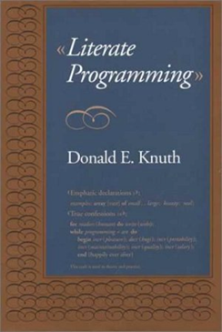
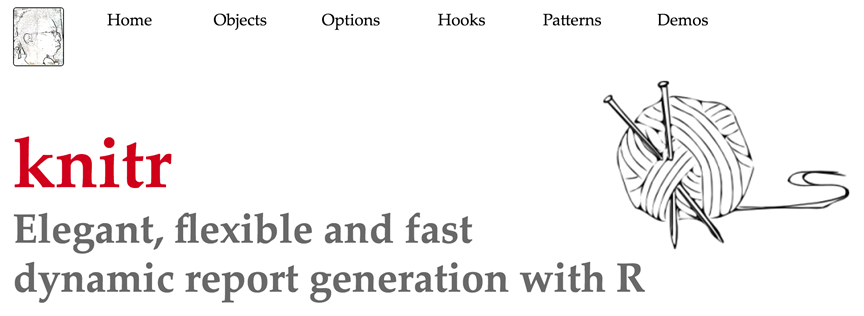
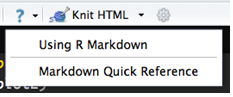
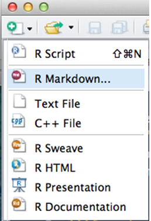
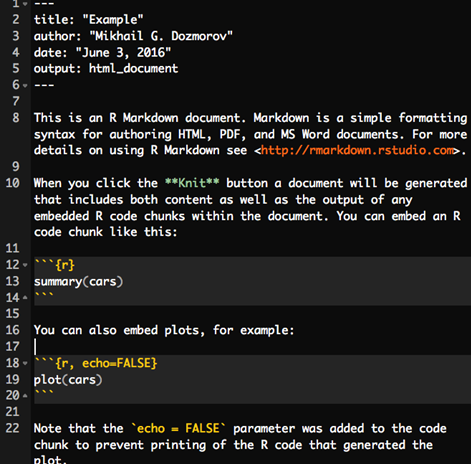
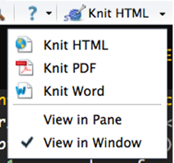

```{r setup, include=FALSE}
require(knitr)
hook_source_def = knit_hooks$get('source')
knit_hooks$set(source = function(x, options){
  if (!is.null(options$verbatim) && options$verbatim){
    opts = gsub(",\\s*verbatim\\s*=\\s*TRUE\\s*", "", options$params.src)
    bef = sprintf('\n\n    ```{r %s}\n', opts, "\n")
    stringr::str_c(bef, paste(knitr:::indent_block(x, "    "), collapse = '\n'), "\n    ```\n")
  } else {
     hook_source_def(x, options)
  }
})
```

## Literate programming

Let us change our traditional attitude to the construction of programs: Instead of imagining that our main task is to instruct a computer what to do, **let us concentrate rather on explaining to humans what we want the computer to do.** 

--*Donald E. Knuth, Literate Programming, 1984*

<center>

</center>


# knitR

## Writing reports

- **HTML**: HyperText Markup Language, used to create web pages. Developed in 1993

- **LaTeX**: a typesetting system for production of technical/scientific documentation, PDF output. Developed in 1994

- **Sweave**: a tool that allows embedding of the R code in LaTeX documents, PDF output. Developed in 2002

- **Markdown**: a lightweight markup language for plain text formatting syntax. Easily converted to HTML


## HTML example

- HTML files have .html extension

- Pairs of tags define content/formatting

```{html echo=TRUE, eval=FALSE}
<h1> Header level 1 </h1>
<a href="http://www.."> Link </a>
<p> Paragraph </p>
```


## HTML example

```{html echo=TRUE, eval=FALSE}
<!DOCTYPE html>
<html>
<head>
<meta http-equiv="Content-Type" content="text/html; charset=utf-8"/>
</head>
<body>
<h1>Markdown example</h1>
<p>This is a simple example of a Markdown document.</p>
You can emphasize code with <strong>bold</strong> or <em>italics</em>, or <code>monospace</code> font.
</body>
</html>
```


## LaTeX example

- LaTeX files usually have a .tex extension
- LaTeX commands define appearance of text, and other formatting structures

&nbsp;

[http://www.electronics.oulu.fi/latex/examples/example_1](http://www.electronics.oulu.fi/latex/examples/example_1)

## LaTeX example
```{latex echo=TRUE, eval=FALSE}
\documentclass{article}
\usepackage{graphicx}
\begin{document}
\title{Introduction to \LaTeX{}}
\author{Author's Name}
\maketitle
\begin{abstract}
This is abstract text: This simple document shows very basic features 
\LaTeX{}```.
\end{abstract}
\section{Introduction}
```


## Sweave example

- Sweave files typically have `.Rnw` extension
- LaTeX syntax for text, `<<chunk_name>>= <code> @` syntax outlines code blocks

```{sweave echo=TRUE, eval=FALSE}
\documentclass{article}
\usepackage{amsmath}
\usepackage{natbib}
\usepackage{indentfirst}
\DeclareMathOperator{\logit}{logit}
% \VignetteIndexEntry{Logit-Normal GLMM Examples}
\begin{document}
First we attach the dat
<<booth>>=
library(bernor)
data(booth)
attach(booth) 
@
```


## KnitR

- KnitR: a package for dynamic report generation written in R Markdown. PDF, HTML, DOCX output. Developed in 2012

[https://github.com/yihui/knitr](https://github.com/yihui/knitr)

`install.packages('knitr', dependencies = TRUE)`
<center>

</center>


## Markdown syntax

<center>

</center>

`*italic*` `_italic_` &nbsp;&nbsp;&nbsp; _italics_ 

`**bold**` `__bold__` &nbsp;&nbsp;&nbsp; __bold__

**Headers**

`# Header 1`

`## Header 2`

`### Header 3`


## Markdown syntax | Lists

**Unordered List**

`* Item 1`

`* Item 2`

&nbsp;&nbsp;&nbsp; `+ Item 2a`

&nbsp;&nbsp;&nbsp; `+ Item 2b`

**Ordered List**

`1. Item 1`

`2. Item 2`

`3. Item 3`

&nbsp;&nbsp;&nbsp; `+ Item 3a`

&nbsp;&nbsp;&nbsp; `+ Item 3b`


## Markdown syntax

`superscript^2^`

`~~strikethrough~~`

**Horizontal Rule / Page Break**

`******`

`------`

**Blockquotes**

A friend once said:

```> It's always better to give```

```> than to receive.```


## Markdown syntax

**Links**

`http://example.com`

`[linked phrase](http://example.com)`

**Images**

``

``


## Markdown syntax

**Tables**

```
First Header  | Second Header
------------- | -------------
Content Cell  | Content Cell
Content Cell  | Content Cell
```

First Header  | Second Header
------------- | -------------
Content Cell  | Content Cell
Content Cell  | Content Cell


## Creating R markdown document

- Regular file with .Rmd extension
- Use RStudio

<center>

</center>


## Creating R markdown document

<center>

</center>


## YAML header (think settings)

- YAML: YAML Ain't Markup Language
- YAML is a simple text-based format for specifying data, like JSON

```{yml echo=TRUE, eval=FALSE}
---
title: "Untitled"
author: "Your Name"
date: "Current date"
output: html_document
---
```

`output` is the critical part - it defines the output format. Can be `pdf_document` or `word_document`


## R Markdown | Code embedding

- Chunks of code are labeled

1. with single backticks, \`\<code\>\`, rendered in a monospace font, non-executable. A simple code formatting option 
2. with single backticks, \` r \<code\>\`, for inline code. **r** indicates executable R code. Instead of hard coding numbers, the inline code allows to evaluate variables in real time.

- There are \` r paste(nrow(my_data))\` rows

- The estimated correlation is \` r cor(x, y)\`

[https://support.rstudio.com/hc/en-us/articles/205368677-R-Markdown-Dynamic-Documents-for-R](https://support.rstudio.com/hc/en-us/articles/205368677-R-Markdown-Dynamic-Documents-for-R)

## Large code chunks

- Marked with triple backticks

&nbsp;

```{r chunk_name, verbatim=TRUE, eval=FALSE}
x = Inf + .Machine$xmin
x
```

- The chunk name is optional
- By default, the code AND its output are displayed in the final report

## Chunk options, comma-separated

- `echo=FALSE` (Default: TRUE): hides the code, but not the results/output. 
- `results='hide'` (Default: 'asis') 	hides the results/output. 'hold' - hold all the output until the end of a chunk. 
- `eval=FALSE` (Default: TRUE): disables code execution. 
- `cache=TRUE` (Default: FALSE): turn on caching of calculation-intensive chunk. 
- `fig.width=##`, `fig.height=##`: customize the size of a figure generated by the code chunk


## Global chunk options

- Some options you would like to set globally, instead of typing them for each chunk

&nbsp;

```{r global_options, verbatim=TRUE, eval=FALSE}
knitr::opts_chunk$set(fig.width=12, fig.height=8, fig.path='Figs/', 
                      echo=FALSE, warning=FALSE, message=FALSE)
```

- `warning=FALSE` and `message=FALSE` suppress any R warnings or messages from being included in the final document
- `fig.path='Figs/'` the figure files get placed in the Figs subdirectory. (Default: not saved at all)

[https://github.com/mdozmorov/MDmisc](https://github.com/mdozmorov/MDmisc)


## An example of R Markdown document

```{r libraries, verbatim=TRUE, echo=TRUE}
library(ggplot2)
```

<span style="font-family: monospace; font-size: 70%;">
There are \` r paste(length(LETTERS))\` letters in English alphabet.
</span>

```{r count_combinations, verbatim=TRUE, echo=TRUE}
max_number_of_combinations <- 5
count_combinations <- list()
for (i in 1:max_number_of_combinations) {
  count_combinations <- c(count_combinations, ncol(combn(length(LETTERS), i)))
}
```

<span style="font-family: monospace; font-size: 70%;">
A total of \` r paste(count_combinations[[2]])\` pairwise combinations of them can be selected. Or, \` r paste(count_combinations[[3]]) \` combinations of three letters can be selected. 
</span>


## Displaying data as tables

- `knitR` has built-in function to display a table

`data(mtcars)`

`knitr::kable(head(mtcars))`

- `pander` package allows more customization

`pander::pander(head(mtcars))`

- `xtable` package has even more options

`xtable::xtable(head(mtcars))`

- `DT` package, an R interface to the DataTables library

`DT::datatable(mtcars)`


## Creating the final report

- Markdown documents `*.md` can be converted to HTML using

`markdown::markdownToHTML('markdown_example.md', 'markdown_example.html')`

- Another option is to use: 

`rmarkdown::render('markdown_example.md')`

At the backend it uses `pandoc` command line tool, installed with Rstudio [http://pandoc.org/](http://pandoc.org/)


## Creating the final report

- Rstudio: one button

- `knit2html()`, `knit2pdf`

<center>

</center>

- **Note**: KnitR compiles the document in an R environment separate from yours (think Makefile). Do not use **./Rprofile** file.


## Things to include in your final report

```{r session_info, verbatim=TRUE, results='hide', message=FALSE}
library("dplyr")
library("pander")
diagnostics <- devtools::session_info()
platform <- data.frame(diagnostics$platform %>% unlist, stringsAsFactors = FALSE)
colnames(platform) <- c("description")
pander(platform)
packages <- as.data.frame(diagnostics$packages)
pander(packages[ packages$`*` == "*", ])
```

- Include `session_info()` at the end: outputs all packages/versions used
- `set.seed(12345)`: initialize random number generator 


