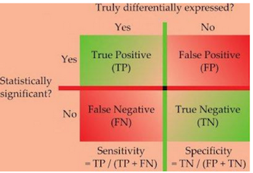
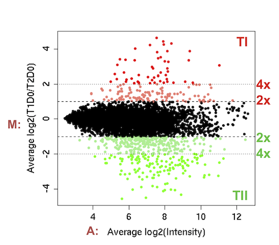
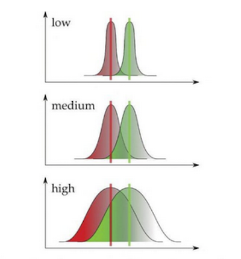
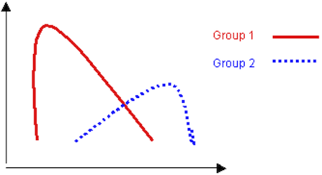
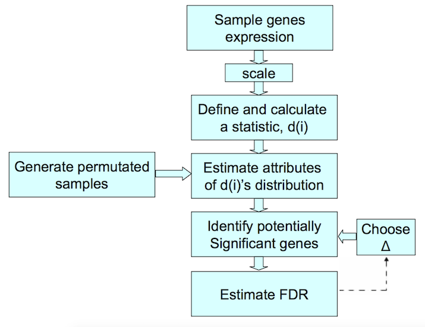
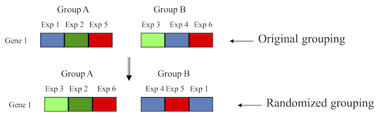
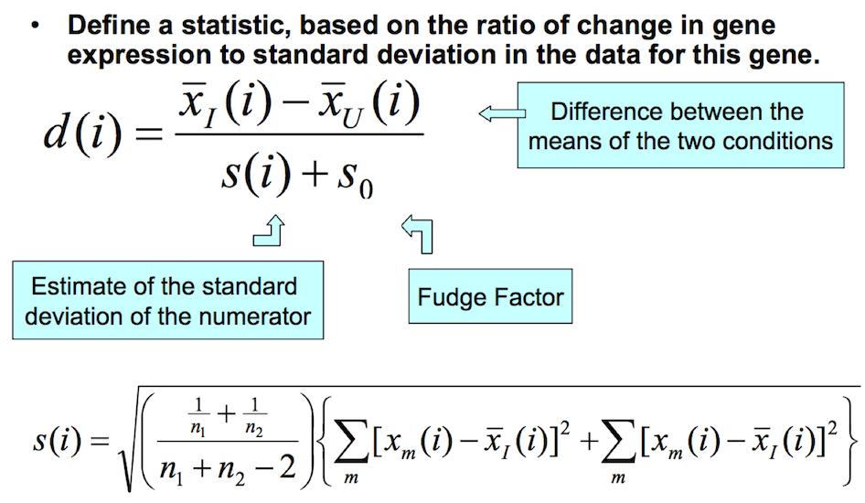
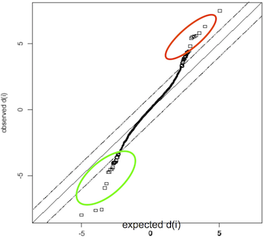
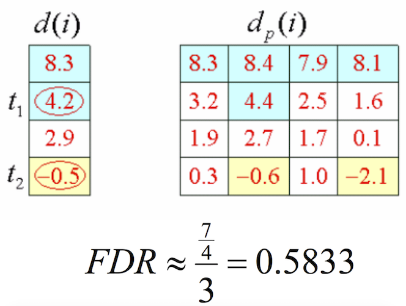

```{r setup, include=FALSE}
require(knitr)
hook_source_def = knit_hooks$get('source')
knit_hooks$set(source = function(x, options){
  if (!is.null(options$verbatim) && options$verbatim){
    opts = gsub(",\\s*verbatim\\s*=\\s*TRUE\\s*", "", options$params.src)
    bef = sprintf('\n\n    ```{r %s}\n', opts, "\n")
    stringr::str_c(bef, paste(knitr:::indent_block(x, "    "), collapse = '\n'), "\n    ```\n")
  } else {
     hook_source_def(x, options)
  }
})
```

## Taxonomy of Microarray Data Analysis Methods {.larger}

**Supervised Learning**

>- Class or group labels are known a priori and the goal of the statistical analysis pertains to identifying differentially expressed genes (AKA feature selection) or identifying combinations of genes that are predictive of class or group membership.

## Taxonomy of Microarray Data Analysis Methods {.larger}

**Unsupervised Learning**

- The statistical analysis seeks to find structure in the data without knowledge of class labels.

## Supervised Learning

- **Class comparison/ Feature selection**
    - T-test / Wilcoxon rank sum test
    - F-test / Kruskal-Wallis test
    - Adjustment for multiple comparisons

&nbsp;

- **Class Prediction**
    - K nearest neighbors
    - Compound Covariate Predictors
    - Classification trees
    - Support vector machines
    - etc.

## Hypothesis testing {.larger}

- The hypothesis that two means $\mu_1$ and $\mu_2$ are equal is called a null hypothesis, commonly abbreviated $H_0$. 

- This is typically written as $H_0: \mu_1=\mu_2$ 

- Its antithesis is the alternative hypothesis, $H_A: \mu_1\neq\mu_2$ 

## Hypothesis testing {.larger}

- A statistical test of hypothesis is a procedure for assessing the compatibility of the data with the null hypothesis.
    - The data are considered compatible with $H_0$ if any discrepancy from $H_0$ could readily be due to chance (i.e., sampling error).
    - Data judged to be incompatible with $H_0$ are taken as evidence in favor of $H_A$.

## Hypothesis testing {.larger}

- If the sample means calculated are identical, we would suspect the null hypothesis is true.

- Even if the null hypothesis is true, we do not really expect the sample means to be identically equal because of sampling variability.

- We would feel comfortable concluding $H_0$ is true if the chance difference in the sample means should not exceed a couple of standard errors.

## Hypothesis Testing {.larger}

- **Type I error**: The probability of rejecting a null hypothesis when it is true. (e.g., a gene is declared to be differentially expressed when it is not.)

- **Type II error**: The probability of accepting a null hypothesis when it is false. (e.g., a gene is declared to not be differentially expressed when it actually is.)

<center>

</center>

## P-value {.larger}

- The p-value for a hypothesis test is the probability, computed under the condition  that the null hypothesis is true, of the test statistic being at least as extreme as the value of the test statistic that was actually obtained.
    - A large p-value (close to 1) indicates a value of t near the center of the t-distribution.
    - A small p-value indicates a value of t in the far tails of the t-distribution.

## Hypothesis testing {.larger}

- The **mean** $\mu_X$ of a random variable $X$ is a measure of central location of the density of $X$.   
- The **variance** of a random variable is a measure of spread or dispersion of the density of $X$. 
- $Var(X)=E[(X-\mu)^2]=\sum\frac{(X-\mu)^2}{(n-1)}=\sigma^2$
- Standard deviation = $\sqrt{Var(X)}=\sigma$

## Two-sample comparison {.larger}

Let us consider the simplest case: two-sample comparison. Our goal is to find the list of genes that are differentially expressed. Suppose we have:

- $n_1$ samples in group 1
- $n_2$ samples in group 2
- For each gene, $n_1 + n_2$ expression levels are recorded for all the samples

Determine which genes have differential expression between the two groups of samples.

## Differential expression {.larger}

- Many microarray experiments are carried out to find genes which are **differentially expressed between two (or more) samples**.

- Initially, comparative microarray experiments were done with few, if any, replicates, and statistical criteria were not used for identifying differentially expressed genes. Instead, simple criteria were used such as fold-change, with 2-fold being a popular cut-off.

- The simplest experiment involves comparing two samples on one array with two-color technology or two arrays if using one-color technology 

## DE by Average Fold-Change (M) {.columns-2}

- Simple fold-change rules give no assessment of statistical significance

- Need to construct test statistics incorporating variability estimates (from replicates). 

<p class="forceBreak"></p>



## Variability and gene expression

- Simplest method, fold change, does not take gene variability into account. 

<center>

</center>

## Two-sample comparison, T-test {.larger}

- In testing $H_0: \mu_1=\mu_2$ against $H_A: \mu_1\neq\mu_2$ note that we could have restated the null hypothesis as                                                      
$H_0: \mu_1-\mu_2=0$ and $H_A: \mu_1-\mu_2\neq 0$

- To carry out the t-test, the first step is to compute the test statistic and then compare the result to a t-distribution with the appropriate degrees of freedom (df) 

- Satterthwaite’s formula:

$$df=\frac{\left(\frac{s_1^2}{n_1}+\frac{s_2^2}{n_2}\right)^2}{\frac{1}{n_1-1}\left(\frac{s_1^2}{n_1}\right)^2+\frac{1}{n_2-1}\left(\frac{s_2^2}{n_2}\right)^2}$$

## Two-sample comparison, T-test

Let the mean and standard deviation expression levels for samples in two groups be

$\bar{x_i}=\frac{1}{n_i}\sum_{j=1}^{n_i}{x_{ij}}$, and $s_i^2=\frac{1}{n_i-1}\sum_{j=1}^{n_i}{(x_{ij}-\bar{x_i})^2}$

The two-sample pooled t-statistice is given by 

$$t=\frac{\bar{x_2}-\bar{x_1}}{s_p\sqrt{1/n_1+1/n_2}}$$

where 

$$s_p^2=\frac{(n_1-1)s_1^2+(n_2-1)s_2^2}{n_1+n_2-2}$$

is the pooled estimate of the standard deviation.

## T-test assumptions {.larger}

- Data must be independent random samples from their respective populations

- Sample size should either be large or, in the case of small sample sizes, the population distributions must be approximately normally distributed.

- When assumptions are not met, non-parametric alternatives are available (Wilcoxon Rank Sum/Mann-Whitney Test)

## Welch’s t-test {.larger}

Does not assume equal variances for each group

$$t_g^{Welch}=\frac{\bar{y_{g1.}}-\bar{y_{g2.}}}{\sqrt{\frac{S_{g1}^2}{n_1}+\frac{S_{g2}^2}{n_2}}}$$

The variances $S_{g1}^2$ and $S_{g2}^2$ are then estimated independently in both groups for each gene

## When there are few replicates... {.larger}

- Fold change using averages $\bar{M}$ can be driven by **outliers**

- T-statistics $\frac{\bar{M}}{se(\bar{M})}$ can be driven by **tiny variances**

>- Solution: "robust" version of t-statistic
>- Replace mean by **median**
>- Replace standard deviation by **median absolute deviation**

## T-test: Probe set 208680_at {.smaller}

| Genechip |   Day 1  |   Day 2  |
|:--------:|:--------:|:--------:|
|     1    |  2013.7  |  1974.6  |
|     2    |  2141.9  |  2027.6  |
|     3    |  2040.2  |  1914.8  |
|     4    |  1973.3  |  1955.8  |
|     5    |  2162.2  |   1963   |
|     6    |  1994.8  |  2025.5  |
|     7    |  1913.3  |  1865.1  |
|     8    |  2068.7  |  1922.4  |
| $\bar{y}$ |  2038.5  |  1956.1  |
| $\bar{\sigma^2}$  | 7051.284 | 3062.991 |
|     n    |     8    |     8    |

## T-test: Probe set 208680_at {.larger}

$$t_g=\frac{(\bar{y_1}-\bar{y_2})-0}{SE_{(\bar{y_1}-\bar{y_2})}}$$

$$t_g=\frac{(2038.5-1965.1)-0}{\sqrt{\frac{7051.3}{8}+\frac{3062.66}{8}}}=2.317$$

$$df=\frac{(7051.3+3062.99)^2}{\frac{7051.3^2}{8-1}+\frac{3062.99^2}{8-1}}=12.116$$

>- p=0.039

## F-test {.larger}

In testing 

$H_0: \mu_1=\mu_2=...=\mu_k$ 

against 

$H_A:$ The $\mu$'s are not all equal 

we use an F-test.

## F-test {.larger}

$$F_g=\frac{between-group\, variability}{within-group\, variability}=\frac{\frac{SS(group)}{df(group)}}{\frac{SS(error)}{df(error)}}$$

$$F_g=\frac{\frac{\sum_{i=1}^k{n_i(\bar{y_{i.}}-\bar{y_{..}})^2}}{k-1}}{\frac{\sum_{i=1}^k{\sum_{j=1}^k{(y_{ij}-\bar{y_{..}})^2}}-\sum_{i=1}^k{n_i(\bar{y_{i.}}-\bar{y_{..}})^2}}{\sum_{i=1}^k{(n_i-1)}}}$$

## Non-parametric tests {.larger}

- Non-normally distributed data
- More robust to outliers
- Less power
- Used when t-test assumptions cannot be met

## Non-parametric tests {.larger}

- **Mann-Whitney test (or Wilcoxon rank-sum test)**
    - differences in the sums of ranks between 2 populations
    - even if the medians are the same, there can be a statistically significant difference from the distribution of ranks

<center>

</center>

## Anova: Analysis of Variance {.larger}

Doing multiple two-sample t-tests would result in an increased chance of committing a Type I error. 

For this reason, ANOVAs are useful in comparing (testing) three or more means (groups or variables) for statistical significance.

**Classes of ANOVA models**

1. Fixed-effects model: a statistical model that represents observed quantities as non-random
2. Random-effects model: used when the treatments are not fixed
3. Mixed model: contains both fixed and random effects 

## Anova: Analysis of Variance {.larger}

Common Designs and Tests
 
- **One-way ANOVA** is used to test for differences among two or more independent groups (means). When there are only two means to compare, the t-test and the ANOVA F-test are equivalent; the relation between ANOVA and t is given by F = t2.

- **Factorial ANOVA** is used when the experimenter wants to study the interaction effects among the treatments.

- **Repeated measures ANOVA** is used when the same subjects are used for each treatment (e.g., in a longitudinal study).

# Differential expression in microarrays studies

## Limma {.larger}

- Limma is an R package to find differentially expressed genes
- Your field guide to microarray data analysis
- It uses linear models fitted to normalized intensities (one-color) or log-ratios (two-color)
- Assumption: normal distribution
- Output: p-values (adjusted for multiple testing)

<http://bioinf.wehi.edu.au/limma/>

<https://bioconductor.org/packages/release/bioc/html/limma.html>

## Limma {.larger}

- Linear models
    - can be used to compare two or more groups
    - can be used for multifactorial designs
        - e.g. genotype and treatment
- Uses empirical Bayes analysis to improve power in small sample sizes
    - Models gene-level error variances $\{\sigma_1^2, ..., \sigma_m^2 \}$ with a scaled inverse $\chi^2$
    - borrowing information across genes

## Limma {.larger}

- **design matrix**
    - defines which conditions arrays belong to
    - rows: arrays; columns: coefficients

- **contrast matrix**
    - specifies which comparisons you would like to make between the RNA samples
    - for very simple experiments, you may not need a contrast matrix

## Moderated t-Statistics {.larger}

- Limma, Moderated t-statistics, described in (Gordon K. Smyth, "Linear Models and Empirical Bayes Methods for Assessing Differential Expression in Microarray Experiments" Statistical Applications in Genetics and Molecular Biology 3 (2004) http://www.statsci.org/smyth/pubs/ebayes.pdf)

$$t_g^{limma} = \frac{\bar{y_{g1.}} - \bar{y_{g2.}}}{S_g^{limma}\sqrt{\frac{1}{n_1} + \frac{1}{n_2}}}$$

where $S_g^{limma}$ is the posterior variance.

## Moderated t-Statistics {.larger}

The posterior variance $S_g^{limma}$ is a combination of an estimate obtained from the prior distribution $S_0^2$ and the pooled variance $S_g^2$

$$S_g^{limma} = \frac{d_0S_0^2 + d_gS_g^2}{d_0 + d_g}$$

where $d_0$ and $d_g$ are, respectively, prior and empirical degrees of freedom

- Including a prior distribution of variances has the effect of borrowing information from all genes to aid with inference about individual genes

## Significance analysis of microarrays (SAM) {.larger}

- V. G. Tusher et.al. "Significance Analysis of Microarrays Applied to the Ionizing Radiation Response" PNAS 2001 http://www.pnas.org/content/98/9/5116.long

- A clever adaptation of the t-ratio to borrow information across genes 

- SAM seeks to control the proportion of false rejections among the set of rejected hypotheses (FDR). 

- Permutation method is used to calculate the null distribution of the modified t-statistics.

## SAM procedure

<center>

</center>

## SAM two-class unpaired

- For each gene, compute the d-value (similar to a t-statistic). This is the observed d-value ($d_i$) for that gene. 
- Randomly shuffle the expression values between groups A and B. Compute the d-value for each randomized set. 
- Take the average of the randomized d-values for each gene. This is the ‘expected relative difference’ ($d_E$) of that gene. Difference between ($d_i$) and ($d_E$) is used to measure significance.   
- Plot $d_{(i)}$ vs. $d_{E(i)}$
- Calculate FDR = average number of genes that exceed $\Delta$ in the permuted data.

<center>

</center>

## SAM statistics

<center>

</center>

## Why $s_0$ ("fudge" factor)? {.larger}

- Prevents $d_{(i)}$ from becoming too large when the variance is close to zero (which can lead to false positives)

- Choose one $s_0$ for the entire dataset, to make the coefficient of variation of $d_{(i)}$ approximately constant

- Typically, $s_0$ can be computed as the $90^{th}$ percentile of the standard errors of all genes

## Estimating significance {.larger}

- We have calculated a new statistics and we don’t have a parametric description of the null distribution 

- Solution: generate an empirical null distribution form a set of experiments where all hypotheses should be null 

- Generate permutations of data labels so no difference is expected 

- For each permutation $p$, calculate $d_{p(i)}$.

## Identifying Significant Genes {.larger}

- Define a threshold $\Delta$
- Find the smallest positive $d_{(i)}$ such that

$$|d_{(i)} - d_{E(i)}| \ge \Delta$$

- Call it $t_1$
- In a similar manner, find the largest negative $d_{(i)}$. Call it $t_2$
- For each gene $i$, if $d_{(i)} \ge t_1 \lor d_{(i)} \le t_2$, call it potentially significant

## Identifying Significant Genes {.larger}

- Rank the original d(i)’s: $d_{(1)} \ge d_{(2)} \ge d_{(3)} \ge ...$
- Plot $d_{(i)}$ vs. $d_{E(i)}$
- For most of the genes, $d_{(i)} \sim d_{E(i)}$

<center>

</center>

## Estimate FDR {.larger}

- $t_1$ and $t_2$ will be used as cutoffs
- Calculate the average number of genes that exceed these values in the permutations.
- Estimate the number of falsely significant genes, under $H_0$:
$$\frac{1}{n.perm}\sum_{p=1}^{n.perm}{number \{ d_{p(i)} \ge t_1 \lor d_{p(i)} \le t_2 \} }$$
- Divide by the number of genes called significant

## Estimate FDR example

<center>

</center>

## Estimate FDR from the reference distribution d

<center>

</center>

Delta $\Delta$ is the half-width of the bar around the 45-degree line

## Other applications of SAM {.larger}

- More than two groups
- Paired data
- Survival data, with censored response 


