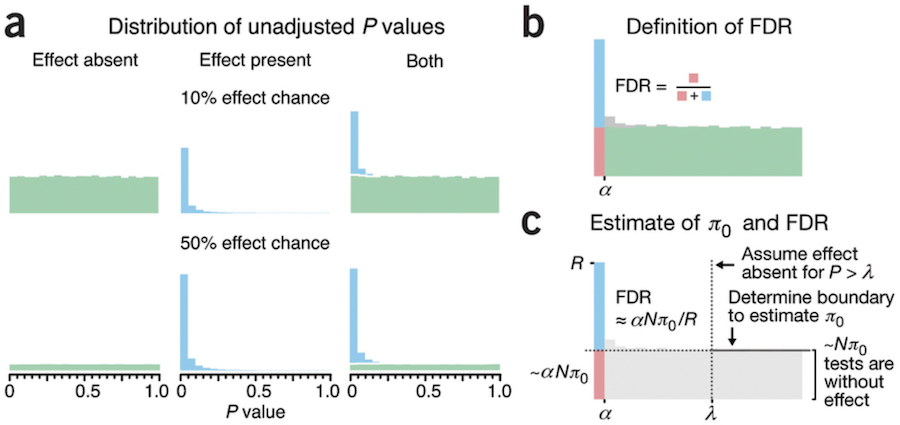

```{r setup, include=FALSE}
require(knitr)
hook_source_def = knit_hooks$get('source')
knit_hooks$set(source = function(x, options){
  if (!is.null(options$verbatim) && options$verbatim){
    opts = gsub(",\\s*verbatim\\s*=\\s*TRUE\\s*", "", options$params.src)
    bef = sprintf('\n\n    ```{r %s}\n', opts, "\n")
    stringr::str_c(bef, paste(knitr:::indent_block(x, "    "), collapse = '\n'), "\n    ```\n")
  } else {
     hook_source_def(x, options)
  }
})
```

## Multiple testing problem {.larger}

- With thousands of genes on a microarray we’re not testing one hypothesis, but many hypotheses – one for each gene

- Analysis of 20,000 genes using commonly accepted significance level $\alpha=0.05$ will identify 1,000 differentially expressed genes simply by chance

- If probability of making an error in one test is 0.05, probability of making at least one error in ten tests is

$$(1-(1-0.05)^{10})=0.40126$$

## Multiple Hypothesis Testing for differential expression detection  {.larger}

- The test statistics and hence the p-values are likely correlated due to co-regulation of the genes.
- Would like multiple testing procedures that take into account the dependence structure of the genes.
- This could be accomplished by estimating the joint null distribution of the unadjusted, unknown p-values.

## Permutation based methods {.larger}

**Permutation based adjusted p-values**

- Under the $H_0$, the joint distribution of the test statistics can be estimated by permuting the columns of the gene expression matrix
- Permuting entire columns creates a situation in which membership to the groups being compared is independent of gene expression but preserves the dependence structure between genes

## Permutation based methods {.larger}

- Permutation algorithm for the $b^{th}$ permutation, $b = 1, ..., B$

1) Permute the $n$ columns of the data matrix $X$
2) Compute test statistics $t_{j,b}$ for each hypothesis (gene, $j=1, ..., g$)

- The permutation distribution of the test statistic $T_j$ for hypothesis $H_j$ is given by the empirical distribution of $t_{j,1}, ..., t_{j,B}$

## Permutation based methods {.larger}

- For two-sided alternative hypotheses, the permutation p-value for hypothesis $H_j$ is

$$p_j^* = \frac{\sum_{b=1}^B{I(\vert{t_{j,b}}\vert \ge \vert{t_j}\vert)}}{B}$$

where $I(*)$ is the indicator function, equaling 1 if the condition in parentheses is true and 0 otherwise.

## Permutation based methods {.larger}

- Permutation method permits estimation of the joint null distribution of the unadjusted unknown p-values.

- Dependency structure between the genes is preserved.

- May suffer from a granularity problem (when two groups, should have  6 arrays in each group to use permutation based method).  

$n/n1!n2!$ ways of forming two groups


## Results of Multiple hypothesis testing

Assume we are testing $H_1, H_2, ..., H_m.$ $m_0$ - # of true null hypotheses

|               |   # false  |  # true    |       |
|:-------------:|:----------:|:----------:|------:|
|               | null hypo. | null hypo. |       |
| # non-signif. |   **U**    |    **T**   | m - R |
| # significant |   **V**    |    **S**   |     R |
|               |     m0     |    m-m0    |       |

- **U, S** -	True negatives/positives *unobservable random variable
- **V** - 		False positives [Type I errors] *
- **T** - 		False negatives [Type II errors ] *
- **R** -		  All positives (# of rejected null hypotheses)	Observable 

## Error rates {.larger}

False Discovery rate (FDR)

$$E \left[ \frac{False \; Discoveries}{True \; Discoveries}  \right]$$

Family wise error rate (FWER)

$$Pr(Number \; of \; False \; positives \ge 1)$$

Expected number of false positives

$$E[Number \; of \; False \; positives]$$

## Interpretation {.larger}

Suppose 550 out of 10,000 genes are significant at $\alpha = 0.05$

**P-value < 0.05**

- Expect $0.05*10,000=500$ false positives

**False Discovery Rate < 0.05**

- Expect $0.05*550=27.5$ false positives

**Family Wise Error Rate < 0.05**

- The probability of at least 1 false positive is $\le 0.05$

## Multiple Hypothesis Testing: FWER {.larger}

- Given $p$ is the probability of error, $1-p$ is the probability of correct choice in one test

- $1-(1-p)^g$ is the probability of one error in $g$ tests

## Multiple Hypothesis Testing: FWER {.larger}

- Given $p$ is the probability of error, $1-p$ is the probability of correct choice in one test

- $1-(1-p)^g$ is the probability of one error in $g$ tests

**Sidak single step**

- Testing $g$ null hypotheses
- Reject any $H_i$ with $p\le 1-\sqrt[g]{1-\alpha}$

- When testing 22,283 genes for differential expression, use the following cutoff:
$$1-\sqrt[22,283]{1-0.05}=0.000002302$$

## Multiple Hypothesis Testing: FWER {.larger}

**Bonferroni procedure**

- Testing $g$ null hypothesis
- Reject any $H_i$ with $p_i \le \alpha / g$
- 0.05/22,283 = 0.0000022

## Multiple Hypothesis Testing: FWER {.larger}

**Bonferroni procedure**

- Testing $g$ null hypothesis
- Reject any $H_i$ with $p_i \le \alpha / g$
- 0.05/22,283 = 0.0000022
- Controls the FWER to be $\le \alpha$ and to be equal to $\alpha$ if all hypotheses are true.
- As the number of hypotheses increases, the average power for an individual hypothesis decreases
- Very conservative; no attempt to incorporate dependence between tests

## Multiple Hypothesis Testing: FWER {.larger}

**Holm step-down procedure**

1. Order the p-values and hypotheses $P_1 \ge ... \ge P_g$ corresponding to $H_1, ..., H_g$
2. Let $i = 1$
3. If $P_{g-i+1} > \alpha / (g - 1 + 1)$ then accept all remaining hypotheses $H_{g-i+1}$ and STOP
4. If $P_{g-i+1} \le \alpha / (g - 1 + 1)$ then reject $H_{g-i+1}$ and increment $i$, then return to step 3.

## Multiple Hypothesis Testing: FWER {.larger}

**Sidak step down**

1. Order the p-values and hypotheses $P_1 \ge ... \ge P_g$ corresponding to $H_1, ..., H_g$
2. Let $i = 1$
3. If $P_{g-i+1} > 1 - \sqrt[g - 1 + 1]{1 - \alpha}$ then accept all remaining hypotheses $H_{g-i+1}$ and STOP
4. If $P_{g-i+1} \le 1 - \sqrt[g - 1 + 1]{1 - \alpha}$ then reject $H_{g-i+1}$ and increment $i$, then return to step 3.

## Multiple Hypothesis Testing: FWER {.larger}

**Hochberg step up**

1. Order the p-values and hypotheses $P_1 \ge ... \ge P_g$ corresponding to $H_1, ..., H_g$
2. Let $i = 1$
3. If $P_i \le \alpha / i$ then reject all remaining hypotheses $H_i, ..., H_g$ and STOP
4. If $P_i > \alpha / i$ then accept $H_i$ and increment $i$, then return to step 3.

## Considerations for controlling the FWER {.larger}

- Control over FWER is only appropriate in situations where the intent is to identify only a small number of genes that are truly different.

- Otherwise, the severe loss in power in controlling FWER is not justified.

## Considerations for controlling the FWER {.larger}

- Approaches that set out to control the FWER seek to control the probability of at least one false positive regardless of the number of hypotheses being tested.

- When the number of hypotheses N is very large, this may be too strict = too many missed findings.

## False discovery rates: FDR {.larger}

- It may be more appropriate to emphasize the proportion of false positives among the differentially expressed genes.

- The expectation of this proportion is the false discovery rate (FDR) (Benjamini & Hochberg, 1995)

## False discovery rate | Benjamini and Hochberg 1995 {.larger}

**Definition**: FDR is the proportion of false positives among all positives

$$FDR = E\left[ \frac{V}{V+S} \right] = E\left[ \frac{V}{R} \right]$$

- Select the desired proportion $q$, e.g., 0.1 (10%)
- Rank the p-values $p_1 \le p_2 \le ... \le p_m$.
- Find the largest rank $i$ such that $p_i \le \frac{i}{m} * q$
- Reject null hypotheses corresponding to $p_1, ..., p_i$

## False positive vs. False discovery rates    {.larger}

False positive rate is **the rate at which truly null genes are called significant**

$$FPR \approx \frac{false\,positives}{truly\,null} = \frac{V}{m_0}$$

False discovery rate is **the rate at which significant genes are truly null**

$$FDR \approx \frac{false\,positives}{called\,significant} = \frac{V}{R}$$

## False Discovery Rates {.larger}

Two procedures for controlling FDR:

- Fix the acceptable FDR level $\sigma$ a priori, then find a data-dependent threshold so that the $FDR \ge \sigma$. (Benjamini & Hochberg)
- Fix the threshold rule and then form an estimate of the FDR whose expectation is $\ge$ the FDR rule over the significance region. (Storey)

## Storey’s positive FDR (pFDR) {.larger}

$$BH:\, FDR=E\left[ \frac{V}{R}|R>0  \right]p(R>0)$$

$$Storey:\, pFDR=E\left[ \frac{V}{R}|R>0  \right]$$

- Since P(R > 0) is ~ 1 in most genomics experiments, FDR and pFDR are very similar
- Omitting P(R > 0) facilitated development of a measure of significance in terms of the FDR for each hypothesis

## Q-value {.larger}

- Storey & Tibshirani, "**Statistical significance for genomewide studies**", PNAS, 2003 http://www.pnas.org/content/100/16/9440.full
- Empirically derived – uses the p-value distribution 
- Storey's method first estimates the fraction of comparisons for which the null is true, $\pi_0$, counting the number of $P$ values larger than a cutoff $\lambda$ (such as 0.5) relative to $(1 − \lambda)*N$ (such as $N/2$), the count expected when the distribution is uniform 
- Multiply the Benjamini & Hochberg FDR by $\pi_0$, thus less conservative 

## Q-value

<center>

</center>

Martin Krzywinski	& Naomi Altman "**Points of significance: Comparing samples—part II**" _Nature Methods_  2016 http://www.nature.com/nmeth/journal/v11/n4/full/nmeth.2900.html

## Q-value {.larger}

- q-value is defined as the minimum FDR that can be attained when calling a "feature" significant (i.e., expected proportion of false positives incurred when calling that feature significant)

- The estimated q-value is a function of the p-value for that test and the distribution of the entire set of p-values from the family of tests being considered

- Thus, in an array study testing for differential expression, if gene X has a q-value of 0.013 it means that 1.3% of genes that show pvalues at least as small as gene X are false positives

